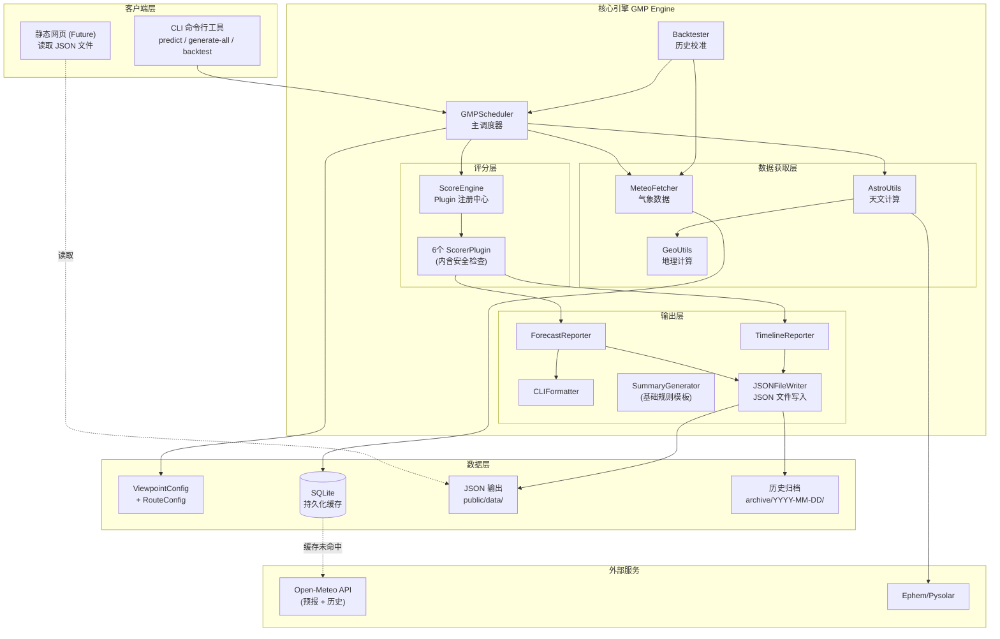
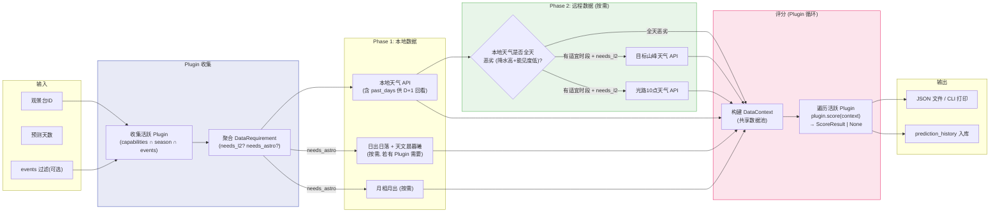
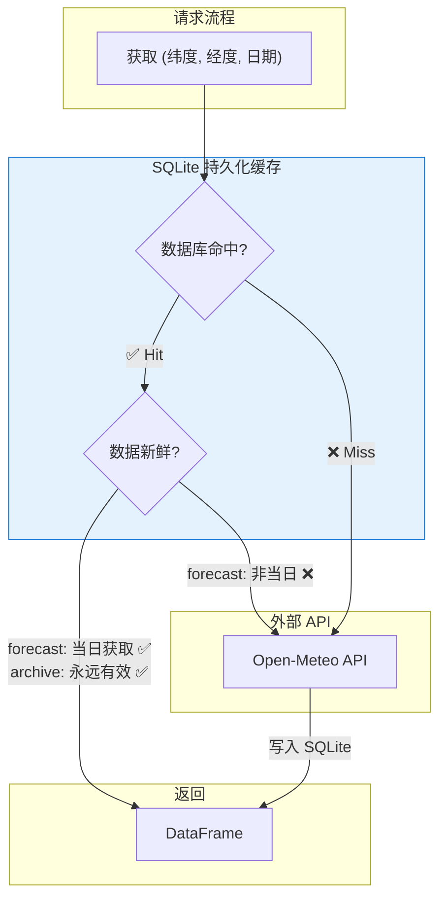

# 1. 系统架构

## 1.1 产品背景

本系统致力于为川西高原旅行者提供**智能化的景观预测服务**，将复杂的气象、天文数据转化为简洁、可操作的**"最佳观景时刻表"**，帮助用户在有限的旅行时间内最大化观赏体验。

**目标用户**: 风光摄影师、周末自驾者、徒步爱好者、旅行APP运营方。  
**核心能力**: 日照金山预测、云海预测、观星指数、雾凇预测、树挂积雪预测、冰挂预测，以及未来可扩展的更多景观类型。

## 1.2 设计目标与原则

| 原则 | 说明 |
|------|------|
| **Plugin 自治** | 每个 Plugin 独立判定触发条件与安全检查 (降水/能见度)，无外部门控 |
| **跨观景台复用** | 相同坐标的天气数据只获取一次，通过 SQLite 缓存共享 |
| **可配置化** | 所有评分阈值、权重均可通过配置调整 |
| **可插拔** | 新增景观类型只需实现 `ScorerPlugin` 并注册，无需改动管线 |
| **数据复用** | Scheduler 聚合所有 Plugin 的数据需求，一次获取后通过 `DataContext` 共享 |
| **预计算分发** | 引擎定时批量生成预测 JSON，前端通过静态文件读取，计算与分发解耦 |
| **可回溯校验** | 所有预测结果存入 DB 并归档 JSON，支持历史回顾与模型校准 |
| **最小可验证** | 优先实现核心预测能力，安全认证等后续迭代 |

## 1.3 术语表

| 术语 | 定义 |
|------|------|
| **日照金山** | 日出/日落时分，阳光照射在雪山上呈现金黄色的壮观景象 |
| **云海** | 观景台位于云层之上，低云如海浪般在脚下翻涌 |
| **光路** | 太阳光线到达山峰的路径，若中途有厚云遮挡则无法形成金山 |
| **方位角 (Azimuth)** | 太阳相对于正北方向的水平角度 (0°=北, 90°=东, 180°=南) |
| **云底高度** | 云层底部距海平面的高度，低于观景台海拔时可能形成云海 |
| **月相** | 月球被照亮的比例 (0%=新月, 100%=满月)，影响夜间观星 |
| **雾凇** | 低温高湿无风条件下，过冷水雾凝结在树枝等物体上形成的冰晶景观 |
| **天文晨曦/暮曦** | 太阳低于地平线 18° 的时刻，此后/此前天空完全黑暗 |
| **ScorerPlugin** | 可插拔评分器，声明数据需求并独立评分，含触发判定，详见 [03-scoring-plugins.md](./03-scoring-plugins.md) |
| **DataContext** | 共享数据上下文，所有 Plugin 复用同一份天气/天文数据，避免重复请求 |

---

## 1.4 整体架构



> [!NOTE]
> **WebUI → 静态 JSON**: 未来的 Web UI 直接读取 `public/data/` 下的静态 JSON 文件，不经过引擎实时计算。

---

## 1.5 运行模式

GMP 引擎采用**预计算 + 静态分发**模式，与实时 API 架构解耦：

| 模式 | 命令 | 说明 |
|------|------|------|
| **单点预测** | `gmp predict <viewpoint_id> --days 7` | 实时计算单个观景台预测，CLI 输出 |
| **批量生成** | `gmp generate-all --output public/data/` | 遍历所有观景台+线路，生成 JSON 文件 |
| **历史回测** | `gmp backtest <viewpoint_id> --date 2025-12-01` | 使用历史天气数据验证评分模型 |
| **观景台列表** | `gmp list-viewpoints` | 列出所有已配置的观景台 |
| **线路列表** | `gmp list-routes` | 列出所有已配置的线路 |

> [!IMPORTANT]
> **预计算频率**: 建议每日运行 1~3 次 (`cron` 定时任务)，如 05:00 / 12:00 / 20:00。
> 每次运行结果同时写入 `public/data/` (最新) 和 `archive/` (历史归档)。

---

## 1.6 数据流架构 (Plugin 驱动)

> [!IMPORTANT]
> **设计原则：先聚合需求，再统一获取；Plugin 自治评分。**  
> 1. Scheduler 聚合所有活跃 Plugin 的 `DataRequirement`，一次获取数据后通过 `DataContext` 共享
> 2. 每个 Plugin 在 `score()` 内部自行判断安全条件 (降水/能见度)，仅对关注时段做检查
> 3. 不同时间窗口的 Plugin 独立判断 — 上午降水不影响夜间观星判定



> [!TIP]
> **数据复用保证**：
> - 本地天气：获取 1 次，所有 Plugin 通过 `DataContext.local_weather` 共享
> - 天文数据：仅当有 Plugin 声明 `needs_astro=True` 时获取，获取后共享
> - 目标天气/光路天气：仅当有 Plugin 声明 `needs_l2_target/needs_l2_light_path` 时获取，通过 SQLite 缓存层坐标去重
> - **Phase 2 优化**：若本地天气全天降水概率均 ≥ 50% 且能见度均 < 1km，跳过 Phase 2 远程调用以节省 API 配额

---

## 1.7 JSON 输出结构

```
public/data/                              ← 最新预测 (前端读取)
├── index.json                            ← 观景台 + 线路索引
├── viewpoints/
│   ├── niubei_gongga/
│   │   ├── forecast.json                 ← 多日预测
│   │   └── timeline.json                 ← 逐时数据
│   ├── zheduo_gongga/
│   │   ├── forecast.json
│   │   └── timeline.json
│   └── ...
├── routes/
│   ├── lixiao/
│   │   └── forecast.json                 ← 线路聚合预测
│   └── ...
└── meta.json                             ← 生成时间、版本

archive/                                  ← 历史预测归档
├── 2026-02-12T05-00/
│   ├── viewpoints/
│   │   └── (同 public/data/viewpoints 结构)
│   ├── routes/
│   │   └── (同 public/data/routes 结构)
│   └── meta.json
├── 2026-02-12T12-00/
│   └── ...
└── ...
```

> [!NOTE]
> **历史归档用途**：
> - 对比同一日期不同时间的预测变化（如早上预测 vs 中午更新）
> - 对照实际观测结果，校准评分模型的准确性
> - 归档可按保留策略定期清理（如保留最近 90 天）

---

## 1.8 缓存架构设计 (SQLite 持久化)

> [!TIP]
> **设计目标**
> 1. **跨观景台复用**: 观景台 A/B 都观察贡嘎雪山 → 贡嘎的云量数据只获取一次
> 2. **历史回溯**: 保存每次预测数据，用于未来准确性校验
> 3. **跨运行复用**: SQLite 持久化，同一天多次 CLI 运行可复用已有数据

> [!NOTE]
> **CLI 单次运行模式**: 每次 CLI 运行都是独立进程，无内存缓存。SQLite 作为唯一缓存层，
> 通过**数据新鲜度**而非 TTL 判定有效性：
> - `forecast` 数据：`fetched_at` 为当日则有效
> - `archive` 数据：永不过期（历史天气不变）


