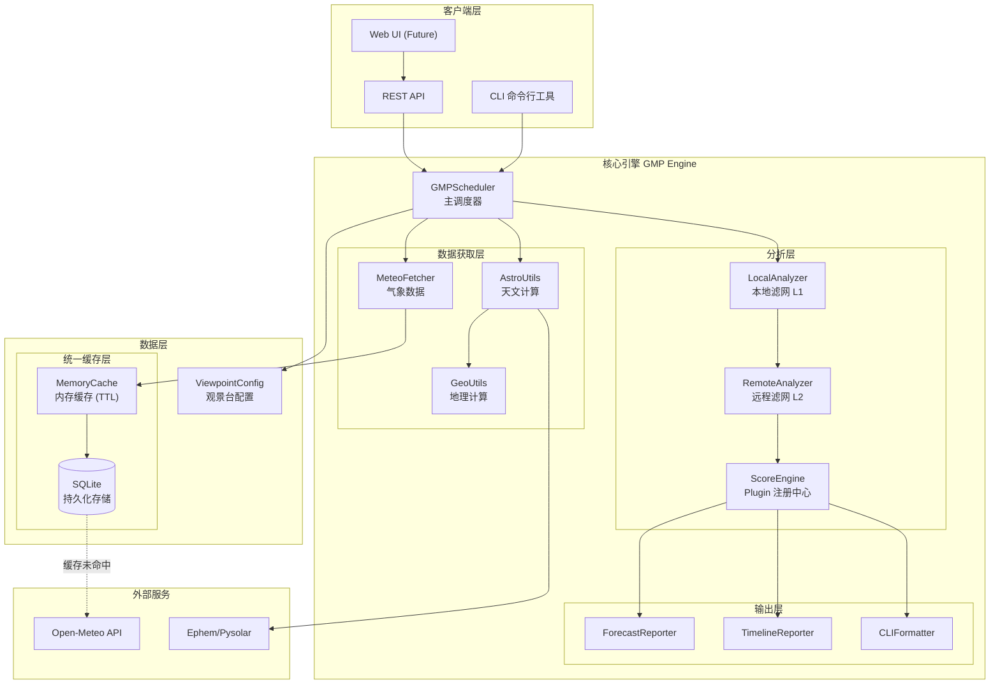
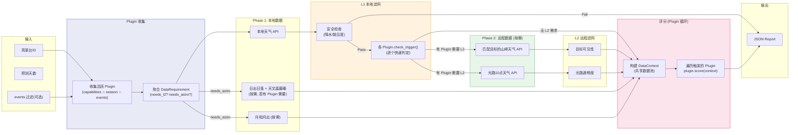
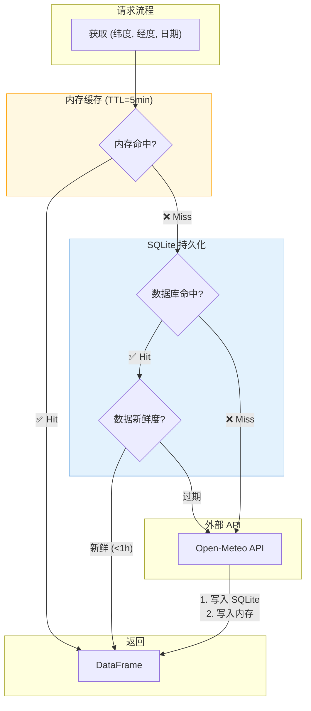

# 1. 系统架构

## 1.1 产品背景

本系统致力于为川西高原旅行者提供**智能化的景观预测服务**，将复杂的气象、天文数据转化为简洁、可操作的**"最佳观景时刻表"**，帮助用户在有限的旅行时间内最大化观赏体验。

**目标用户**: 风光摄影师、周末自驾者、徒步爱好者、旅行APP运营方。  
**核心能力**: 日照金山预测、云海预测、观星指数、雾凇预测，以及未来可扩展的更多景观类型。

## 1.2 设计目标与原则

| 原则 | 说明 |
|------|------|
| **先过滤，后获取** | L1 本地滤网通过后，才触发远程 API 调用，最小化外部依赖 |
| **跨观景台复用** | 相同坐标的天气数据只获取一次，通过缓存共享 |
| **可配置化** | 所有评分阈值、权重均可通过配置调整 |
| **可插拔** | 新增景观类型只需实现 `ScorerPlugin` 并注册，无需改动管线或 API |
| **数据复用** | Scheduler 聚合所有 Plugin 的数据需求，一次获取后通过 `DataContext` 共享 |
| **最小可验证** | 优先实现核心预测能力，安全认证等后续迭代 |

## 1.3 术语表

| 术语 | 定义 |
|------|------|
| **日照金山** | 日出/日落时分，阳光照射在雪山上呈现金黄色的壮观景象 |
| **云海** | 观景台位于云层之上，低云如海浪般在脚下翻涌 |
| **光路** | 太阳光线到达山峰的路径，若中途有厚云遮挡则无法形成金山 |
| **方位角 (Azimuth)** | 太阳相对于正北方向的水平角度 (0°=北, 90°=东, 180°=南) |
| **云底高度** | 云层底部距海平面的高度，低于观景台海拔时可能形成云海 |
| **月相** | 月球被照亮的比例 (0%=新月, 100%=满月)，影响夜间观星 |
| **雾凇** | 低温高湿无风条件下，过冷水雾凝结在树枝等物体上形成的冰晶景观 |
| **天文晨曦/暮曦** | 太阳低于地平线 18° 的时刻，此后/此前天空完全黑暗 |
| **L1 滤网** | 本地滤网，仅使用观景台所在位置的天气数据进行安全/基础过滤 |
| **L2 滤网** | 远程滤网，使用目标山峰和光路检查点的天气数据进行精细判定 |
| **ScorerPlugin** | 可插拔评分器，声明数据需求并独立评分，详见 [03-scoring-plugins.md](./03-scoring-plugins.md) |
| **DataContext** | 共享数据上下文，所有 Plugin 复用同一份天气/天文数据，避免重复请求 |

---

## 1.4 整体架构

```mermaid
flowchart TB
    subgraph Client["客户端层"]
        CLI["CLI 命令行工具"]
        API["REST API"]
        WebUI["Web UI (Future)"]
    end

    subgraph Core["核心引擎 GMP Engine"]
        Scheduler["GMPScheduler<br/>主调度器"]
        
        subgraph Fetcher["数据获取层"]
            MF["MeteoFetcher<br/>气象数据"]
            AU["AstroUtils<br/>天文计算"]
            GU["GeoUtils<br/>地理计算"]
        end
        
        subgraph Analyzer["分析层"]
            LA["LocalAnalyzer<br/>本地滤网 L1"]
            RA["RemoteAnalyzer<br/>远程滤网 L2"]
            SE["ScoreEngine<br/>Plugin 注册中心"]
        end
        
        subgraph Reporter["输出层"]
            FR["ForecastReporter"]
            TR["TimelineReporter"]
            CF["CLIFormatter"]
        end
    end

    subgraph Data["数据层"]
        Config["ViewpointConfig<br/>观景台配置"]
        subgraph CacheLayer["统一缓存层"]
            MemCache["MemoryCache<br/>内存缓存 (TTL)"]
            SQLite[("SQLite<br/>持久化存储")]
        end
    end

    subgraph External["外部服务"]
        MeteoAPI["Open-Meteo API"]
        EphemLib["Ephem/Pysolar"]
    end

    CLI --> Scheduler
    API --> Scheduler
    WebUI --> API
    
    Scheduler --> MF
    Scheduler --> AU
    Scheduler --> LA
    
    MF --> MemCache
    MemCache --> SQLite
    SQLite -.->|"缓存未命中"| MeteoAPI
    AU --> EphemLib
    AU --> GU
    
    LA --> RA
    RA --> SE
    SE --> FR
    SE --> TR
    SE --> CF
    
    Scheduler --> Config
```

> [!NOTE]
> **WebUI → API**: Web UI 通过 REST API 层间接访问引擎，不直接调用 Scheduler。

---

## 1.5 数据流架构 (Plugin 驱动 + 懒加载)

> [!IMPORTANT]
> **设计原则：先过滤，后获取；先聚合需求，再统一获取。**  
> 1. L1 本地滤网通过后，才触发 L2 所需的远程数据获取  
> 2. Scheduler 聚合所有活跃 Plugin 的 `DataRequirement`，一次获取数据后通过 `DataContext` 共享

```mermaid
flowchart LR
    subgraph Input["输入"]
        VP["观景台ID"]
        Days["预测天数"]
        Events["events 过滤(可选)"]
    end

    subgraph Collect["Plugin 收集"]
        PC["收集活跃 Plugin<br/>(capabilities ∩ season ∩ events)"]
        Agg["聚合 DataRequirement<br/>(needs_l2? needs_astro?)"]
    end

    subgraph Phase1["Phase 1: 本地数据"]
        Local["本地天气 API"]
        Sun["日出日落 + 天文晨暮曦<br/>(按需, 若有 Plugin 需要)"]
        Moon["月相月出 (按需)"]
    end

    subgraph L1["L1 本地滤网"]
        Safety["安全检查<br/>(降水/能见度)"]
        Trigger["各 Plugin.check_trigger()<br/>(逐个快速判定)"]
    end

    subgraph Phase2["Phase 2: 远程数据 (按需)"]
        Target["匹配目标的山峰天气 API"]
        Light["光路10点天气 API"]
    end

    subgraph L2["L2 远程滤网"]
        L2a["目标可见性"]
        L2b["光路通畅度"]
    end

    subgraph Score["评分 (Plugin 循环)"]
        DC["构建 DataContext<br/>(共享数据池)"]
        Loop["遍历触发的 Plugin<br/>plugin.score(context)"]
    end

    subgraph Output["输出"]
        JSON["JSON Report"]
    end

    VP --> PC
    Events --> PC
    PC --> Agg

    Agg --> Local
    Agg -->|"needs_astro"| Sun
    Agg -->|"needs_astro"| Moon

    Local --> Safety
    Safety -->|"Pass"| Trigger
    Safety -->|"Fail"| JSON

    Trigger -->|"有 Plugin 需要 L2"| Target
    Trigger -->|"有 Plugin 需要 L2"| Light
    Trigger -->|"无 L2 需求"| DC

    Target --> L2a
    Light --> L2b

    L2a --> DC
    L2b --> DC
    Sun --> DC
    Moon --> DC

    DC --> Loop
    Loop --> JSON

    style Phase2 fill:#e8f5e9,stroke:#4caf50
    style L1 fill:#fff3e0,stroke:#ff9800
    style Collect fill:#e8eaf6,stroke:#3f51b5
    style Score fill:#fce4ec,stroke:#e91e63
```

> [!TIP]
> **数据复用保证**：
> - 本地天气：获取 1 次，所有 Plugin 通过 `DataContext.local_weather` 共享
> - 天文数据：仅当有 Plugin 声明 `needs_astro=True` 时获取，获取后共享
> - 目标天气/光路天气：仅当有 Plugin 声明 `needs_l2_target/needs_l2_light_path` 时获取，通过缓存层坐标去重

---

## 1.6 缓存架构设计 (SQLite 持久化)

> [!TIP]
> **设计目标**
> 1. **跨观景台复用**: 观景台 A/B 都观察贡嘎雪山 → 贡嘎的云量数据只获取一次
> 2. **历史回溯**: 保存每次预测数据，用于未来准确性校验
> 3. **多级缓存**: 内存 (TTL 5min) → SQLite (持久化) → 外部 API

```mermaid
flowchart TB
    subgraph Request["请求流程"]
        R1["获取 (纬度, 经度, 日期)"]
    end

    subgraph L1Cache["内存缓存 (TTL=5min)"]
        M1{"内存命中?"}
    end

    subgraph L2Cache["SQLite 持久化"]
        S1{"数据库命中?"}
        S2{"数据新鲜度?"}
    end

    subgraph API["外部 API"]
        A1["Open-Meteo API"]
    end

    subgraph Response["返回"]
        RES["DataFrame"]
    end

    R1 --> M1
    M1 -->|"✅ Hit"| RES
    M1 -->|"❌ Miss"| S1
    S1 -->|"✅ Hit"| S2
    S1 -->|"❌ Miss"| A1
    S2 -->|"新鲜 (<1h)"| RES
    S2 -->|"过期"| A1
    A1 --> |"1. 写入 SQLite<br/>2. 写入内存"| RES

    style L2Cache fill:#e3f2fd,stroke:#1976d2
    style L1Cache fill:#fff8e1,stroke:#ffa000
```
