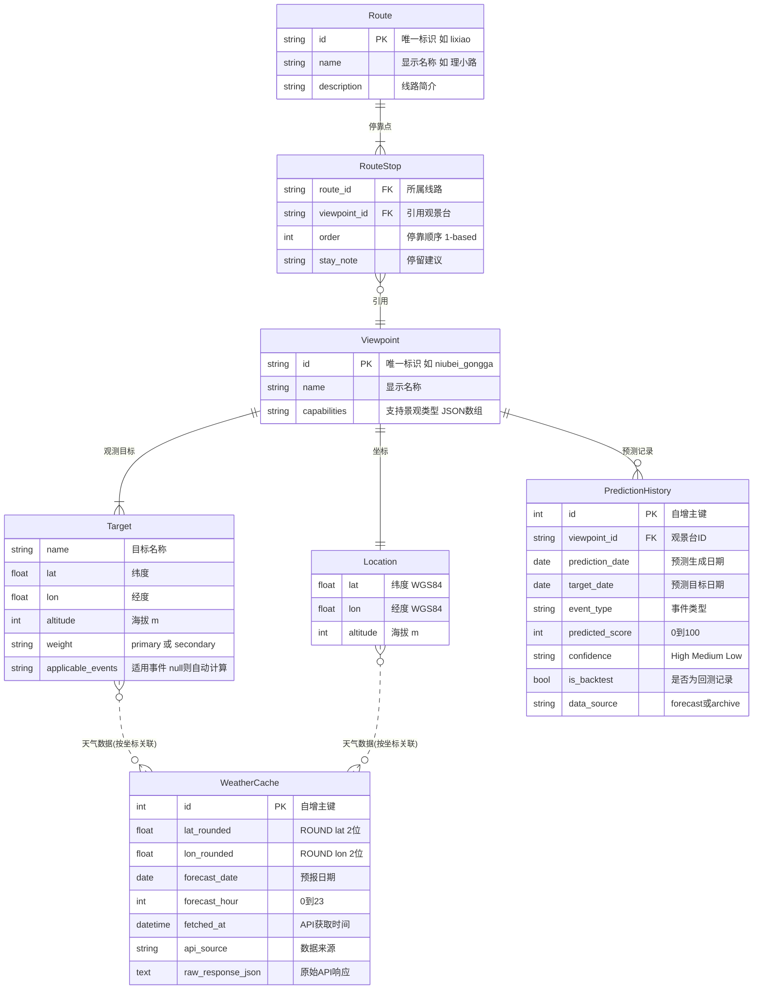

# 2. 核心数据模型

## 2.1 实体关系图



> [!NOTE]
> **WeatherCache 与 Target/Location 的关系**: 通过 `ROUND(lat, 2)` 和 `ROUND(lon, 2)` 的坐标匹配间接关联，而非外键。这使得不同观景台对同一山峰的查询可以自然命中同一条缓存记录。

> [!NOTE]
> **Route 与 Viewpoint 的关系**: Route 通过 RouteStop 引用 Viewpoint，形成 N:M 关系 — 一条线路包含多个观景台，一个观景台可属于多条线路（如子梅垭口同时属于"贡嘎西线"和"贡嘎环线"）。Route 配置独立存放于 `config/routes/*.yaml`，不修改 Viewpoint 配置。

---

## 2.2 数据库表结构

```sql
-- 天气数据缓存表 (按坐标+时间索引)
CREATE TABLE weather_cache (
    id INTEGER PRIMARY KEY AUTOINCREMENT,
    
    -- 坐标键 (精度取到2位小数，约 1km 精度)
    lat_rounded REAL NOT NULL,        -- ROUND(lat, 2)
    lon_rounded REAL NOT NULL,        -- ROUND(lon, 2)
    
    -- 时间键
    forecast_date DATE NOT NULL,      -- 预报目标日期
    forecast_hour INTEGER NOT NULL,   -- 0-23
    
    -- API 元数据
    fetched_at DATETIME NOT NULL,     -- API 调用时间
    api_source TEXT DEFAULT 'open-meteo',
    raw_response_json TEXT,           -- 原始 API 响应 (为未来数据源扩展预留)
    
    -- 天气数据 (核心字段)
    temperature_2m REAL,
    cloud_cover_total INTEGER,        -- 0-100%
    cloud_cover_low INTEGER,
    cloud_cover_medium INTEGER,       -- Open-Meteo API 字段名: cloud_cover_mid
    cloud_cover_high INTEGER,
    cloud_base_altitude REAL,         -- meters (Open-Meteo API 字段名: cloudbase)
    precipitation_probability INTEGER,
    visibility REAL,                  -- meters
    wind_speed_10m REAL,              -- km/h
    snowfall REAL,                    -- cm/h (SnowTree 评分)
    rain REAL,                        -- mm/h (IceIcicle 评分)
    showers REAL,                     -- mm/h (IceIcicle 评分)
    weather_code INTEGER,             -- WMO 天气代码
    
    -- 索引
    UNIQUE(lat_rounded, lon_rounded, forecast_date, forecast_hour)
);

CREATE INDEX idx_coords ON weather_cache(lat_rounded, lon_rounded);
CREATE INDEX idx_date ON weather_cache(forecast_date);
CREATE INDEX idx_fetched ON weather_cache(fetched_at);

-- 预测历史记录表 (用于准确性校验)
CREATE TABLE prediction_history (
    id INTEGER PRIMARY KEY AUTOINCREMENT,
    
    -- 预测信息
    viewpoint_id TEXT NOT NULL,
    prediction_date DATE NOT NULL,    -- 预测生成日期
    target_date DATE NOT NULL,        -- 预测目标日期
    event_type TEXT NOT NULL,         -- 'sunrise_golden_mountain', 'sunset_golden_mountain', 'stargazing', 'cloud_sea', 'frost', 'snow_tree', 'ice_icicle'
    
    -- 预测结果
    predicted_score INTEGER,          -- 0-100
    predicted_status TEXT,            -- 'Perfect', 'Recommended', 'Possible', 'Not Recommended'
    confidence TEXT,                  -- 'High', 'Medium', 'Low'
    conditions_json TEXT,             -- JSON 存储详细条件
    
    -- 实际结果 (待用户反馈填充)
    actual_result TEXT,               -- 'success', 'partial', 'failed', NULL
    user_feedback TEXT,
    feedback_at DATETIME,
    
    -- 回测标识
    is_backtest BOOLEAN DEFAULT 0,    -- 0=真实预测, 1=历史回测
    data_source TEXT DEFAULT 'forecast',  -- 'forecast'=预报数据, 'archive'=历史数据
    
    created_at DATETIME DEFAULT CURRENT_TIMESTAMP
);

CREATE INDEX idx_prediction_target ON prediction_history(target_date);
CREATE INDEX idx_viewpoint ON prediction_history(viewpoint_id);
```

> [!NOTE]
> **`raw_response_json`**: 存储外部 API 的原始 JSON 响应。当前使用 Open-Meteo，未来若切换数据源，可通过此字段保留原始数据，避免改表结构。
> 
> **唯一约束**: `UNIQUE(lat_rounded, lon_rounded, forecast_date, forecast_hour)` 确保同一坐标同一时刻只有一条记录，插入时使用 `INSERT OR REPLACE` 语义。

### `weather_cache` 字段说明

| 字段 | 类型 | 约束 | 说明 |
|------|------|------|------|
| `id` | INTEGER | PK, AUTO | 自增主键 |
| `lat_rounded` | REAL | NOT NULL | 纬度 (ROUND(lat, 2), ≈1km 精度) |
| `lon_rounded` | REAL | NOT NULL | 经度 (ROUND(lon, 2), ≈1km 精度) |
| `forecast_date` | DATE | NOT NULL | 预报目标日期 |
| `forecast_hour` | INTEGER | NOT NULL | 预报小时 (0-23) |
| `fetched_at` | DATETIME | NOT NULL | API 调用时间 (用于TTL判断) |
| `api_source` | TEXT | DEFAULT 'open-meteo' | 数据来源标识 |
| `raw_response_json` | TEXT | | 原始 API 响应 (扩展预留) |
| `temperature_2m` | REAL | | 2m 气温 (°C) |
| `cloud_cover_total` | INTEGER | | 总云量 (0-100%) |
| `cloud_cover_low` | INTEGER | | 低云量 (0-100%), 海拔<2km |
| `cloud_cover_medium` | INTEGER | | 中云量 (0-100%), 海拔 2-6km |
| `cloud_cover_high` | INTEGER | | 高云量 (0-100%), 海拔>6km |
| `cloud_base_altitude` | REAL | | 云底高度 (m), 用于云海判定 |
| `precipitation_probability` | INTEGER | | 降水概率 (0-100%) |
| `visibility` | REAL | | 能见度 (m) |
| `wind_speed_10m` | REAL | | 10m 风速 (km/h) |
| `snowfall` | REAL | | 每小时降雪量 (cm), SnowTree 评分使用 |
| `rain` | REAL | | 每小时降雨量 (mm), IceIcicle 评分使用 |
| `showers` | REAL | | 每小时阵雨量 (mm), IceIcicle 评分使用 |
| `weather_code` | INTEGER | | WMO 天气代码 |

### `prediction_history` 字段说明

| 字段 | 类型 | 约束 | 说明 |
|------|------|------|------|
| `id` | INTEGER | PK, AUTO | 自增主键 |
| `viewpoint_id` | TEXT | NOT NULL | 观景台 ID (如 `niubei_gongga`) |
| `prediction_date` | DATE | NOT NULL | 预测生成日期 (何时做的预测) |
| `target_date` | DATE | NOT NULL | 预测目标日期 (预测哪天) |
| `event_type` | TEXT | NOT NULL | 事件类型 (`sunrise_golden_mountain` / `sunset_golden_mountain` / `stargazing` / `cloud_sea` / `frost` / `snow_tree` / `ice_icicle`) |
| `predicted_score` | INTEGER | | 预测评分 (0-100) |
| `predicted_status` | TEXT | | 状态 (`Perfect` / `Recommended` / `Possible` / `Not Recommended`) |
| `confidence` | TEXT | | 置信度 (`High` T+1~2 / `Medium` T+3~4 / `Low` T+5~16) |
| `conditions_json` | TEXT | | JSON 格式的详细条件 |
| `actual_result` | TEXT | NULL | 实际结果 (用户反馈: `success` / `partial` / `failed`) |
| `user_feedback` | TEXT | NULL | 文字反馈 |
| `feedback_at` | DATETIME | NULL | 反馈时间 |
| `is_backtest` | BOOLEAN | DEFAULT 0 | 0=真实预测, 1=历史回测 |
| `data_source` | TEXT | DEFAULT 'forecast' | 数据来源 (`forecast` 预报 / `archive` 历史) |
| `created_at` | DATETIME | DEFAULT NOW | 记录创建时间 |

---

## 2.3 数据库记录示例

**`weather_cache` 示例数据** — 贡嘎主峰 2026-02-11 日出前后:

```
┌────┬────────────┬────────────┬──────────────┬──────────────┬─────────────────────┬───────┬─────────┬──────┬──────┬──────┬──────────┬───────┬────────────┬──────┐
│ id │ lat_rounded│ lon_rounded│forecast_date │forecast_hour │ fetched_at          │ temp  │ cc_total│cc_low│cc_mid│cc_hi │ cloud_base│precip │ visibility │ wind │
├────┼────────────┼────────────┼──────────────┼──────────────┼─────────────────────┼───────┼─────────┼──────┼──────┼──────┼──────────┼───────┼────────────┼──────┤
│  1 │      29.58 │     101.88 │ 2026-02-11   │            6 │ 2026-02-10 08:00:00 │ -12.3 │      15 │    5 │    8 │    2 │   5200.0 │     0 │    45000.0 │  8.5 │
│  2 │      29.58 │     101.88 │ 2026-02-11   │            7 │ 2026-02-10 08:00:00 │ -10.1 │      10 │    3 │    5 │    2 │   5500.0 │     0 │    50000.0 │  7.2 │
│  3 │      29.58 │     101.88 │ 2026-02-11   │            8 │ 2026-02-10 08:00:00 │  -8.5 │      20 │    5 │   10 │    5 │   5100.0 │     5 │    40000.0 │  9.0 │
│  4 │      29.75 │     102.35 │ 2026-02-11   │            6 │ 2026-02-10 08:00:00 │  -5.2 │      25 │   70 │    5 │    0 │   2800.0 │     0 │    30000.0 │  3.1 │
│  5 │      29.75 │     102.35 │ 2026-02-11   │            7 │ 2026-02-10 08:00:00 │  -3.8 │      22 │   75 │    3 │    0 │   2600.0 │     0 │    35000.0 │  2.8 │
└────┴────────────┴────────────┴──────────────┴──────────────┴─────────────────────┴───────┴─────────┴──────┴──────┴──────┴──────────┴───────┴────────────┴──────┘
```

> id 4-5 是牛背山本地 (29.75, 102.35), id 1-3 是贡嘎主峰 (29.58, 101.88)。
> 如果另一观景台也观测贡嘎，查询 `(29.58, 101.88)` 将直接命中 id 1-3，**无需重复请求 API**。

**`prediction_history` 示例数据**:

```
┌────┬────────────────┬─────────────────┬─────────────┬─────────────────────────┬───────┬───────────────┬────────┬──────────────┬─────────────────┐
│ id │ viewpoint_id   │ prediction_date │ target_date │ event_type              │ score │ status        │ confid │actual_result │ user_feedback   │
├────┼────────────────┼─────────────────┼─────────────┼─────────────────────────┼───────┼───────────────┼────────┼──────────────┼─────────────────┤
│  1 │ niubei_gongga  │ 2026-02-10      │ 2026-02-11  │ sunrise_golden_mountain │    88 │ Recommended   │ High   │ success      │ 拍到了金山!     │
│  2 │ niubei_gongga  │ 2026-02-10      │ 2026-02-11  │ stargazing              │    98 │ Perfect       │ High   │ NULL         │ NULL            │
│  3 │ niubei_gongga  │ 2026-02-10      │ 2026-02-11  │ cloud_sea               │    95 │ Perfect       │ High   │ NULL         │ NULL            │
│  4 │ niubei_gongga  │ 2026-02-10      │ 2026-02-11  │ frost                   │    67 │ Possible      │ High   │ NULL         │ NULL            │
│  5 │ niubei_gongga  │ 2026-02-10      │ 2026-02-11  │ snow_tree               │    46 │ Not Recommend │ High   │ NULL         │ NULL            │
│  6 │ niubei_gongga  │ 2026-02-10      │ 2026-02-11  │ ice_icicle              │    70 │ Possible      │ Medium │ NULL         │ NULL            │
│  7 │ niubei_gongga  │ 2026-02-10      │ 2026-02-14  │ sunrise_golden_mountain │    40 │ Not Recommend │ Low    │ NULL         │ NULL            │
└────┴────────────────┴─────────────────┴─────────────┴─────────────────────────┴───────┴───────────────┴────────┴──────────────┴─────────────────┘
```
