# 6. 类图与时序图

## 6.1 核心类结构

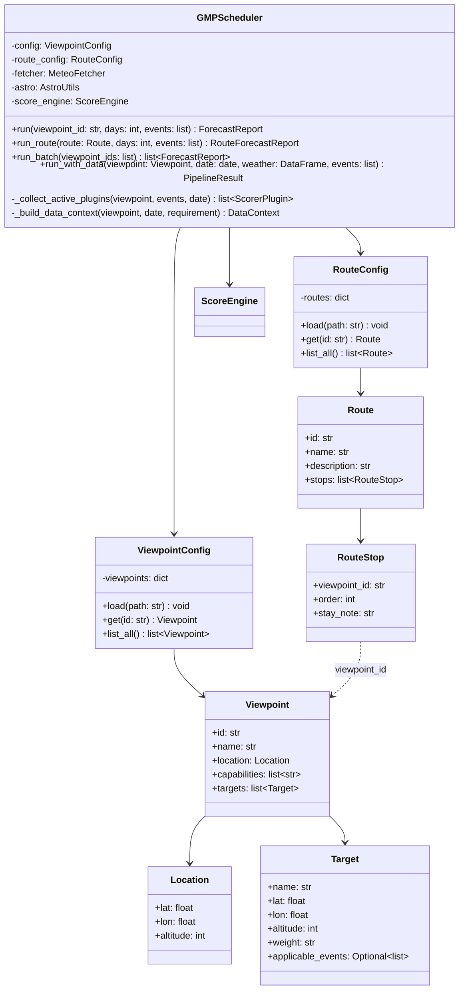

---

## 6.2 数据获取层 (含缓存层)

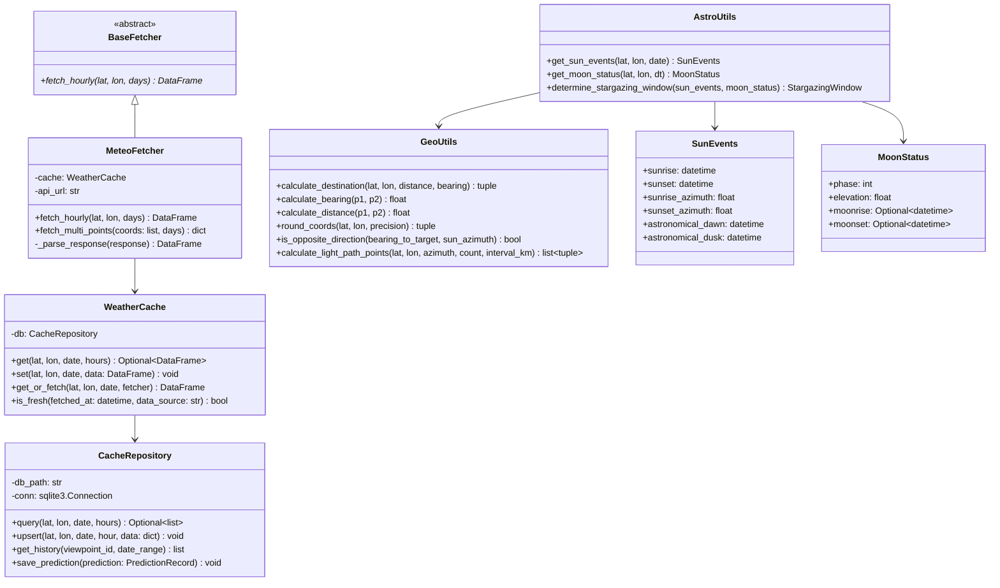

---

## 6.3 分析层 (Plugin 架构)

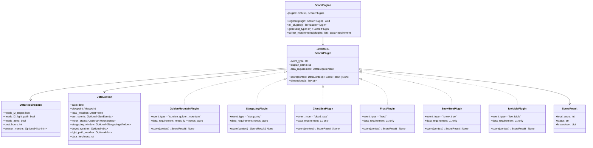

> [!NOTE]
> **扩展新景观**: 只需实现 `ScorerPlugin` 接口并调用 `engine.register(NewPlugin())`，Scheduler 无需任何改动。

---

## 6.4 输出层

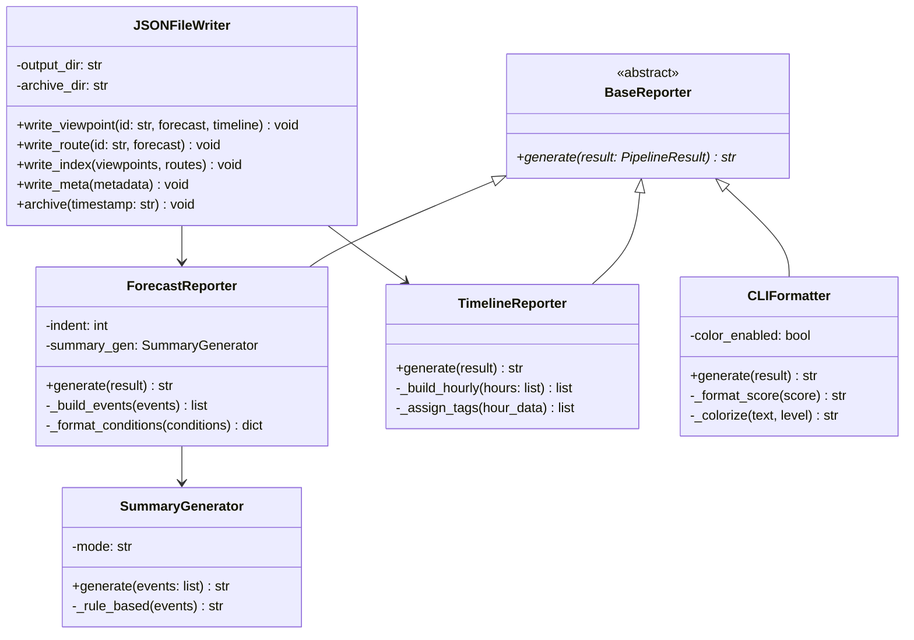

---

## 6.5 主流程时序图 — 7天预报生成 (Plugin 驱动)

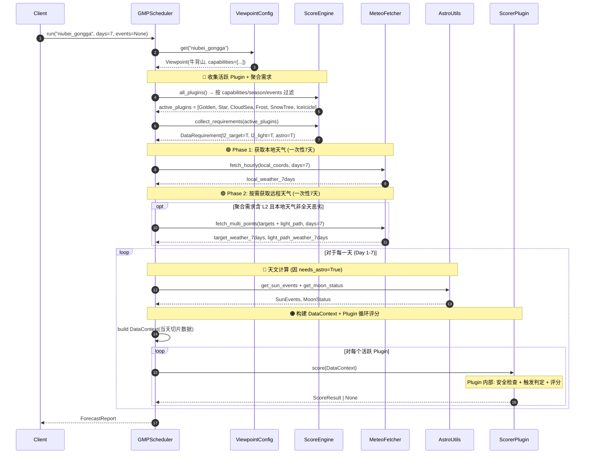

---

## 6.6 缓存与降级流程

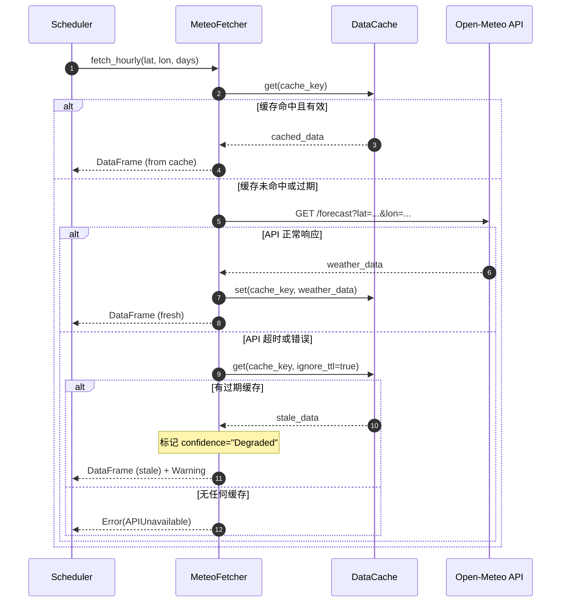

---

## 6.7 云海评分流程

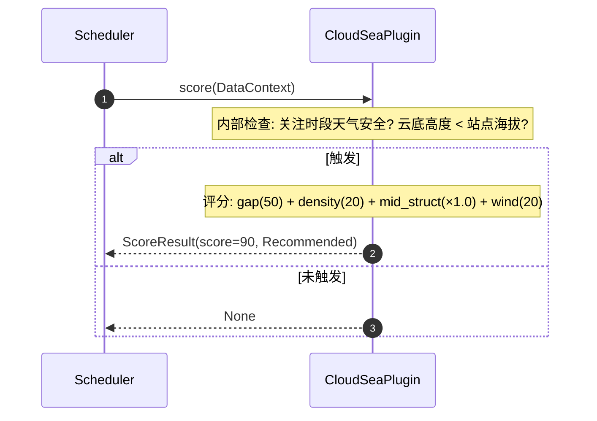

---

## 6.8 雾凇评分流程

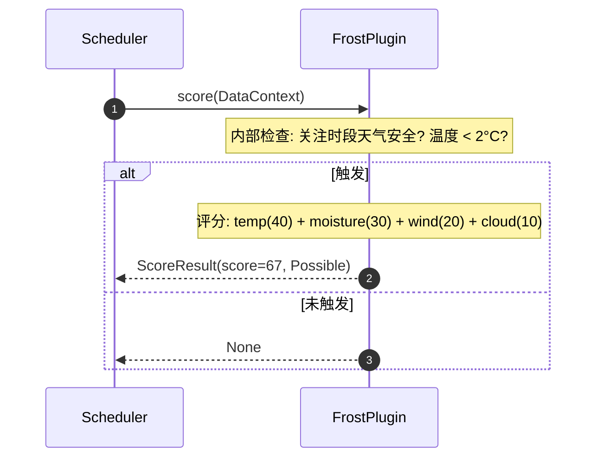

---

## 6.9 树挂积雪评分流程 (留存场景)

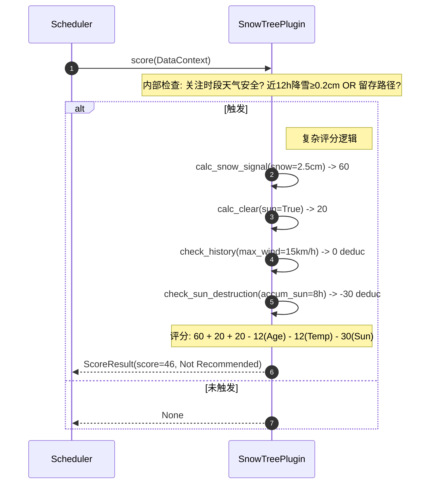

---

## 6.10 线路预测时序图 — Route Forecast

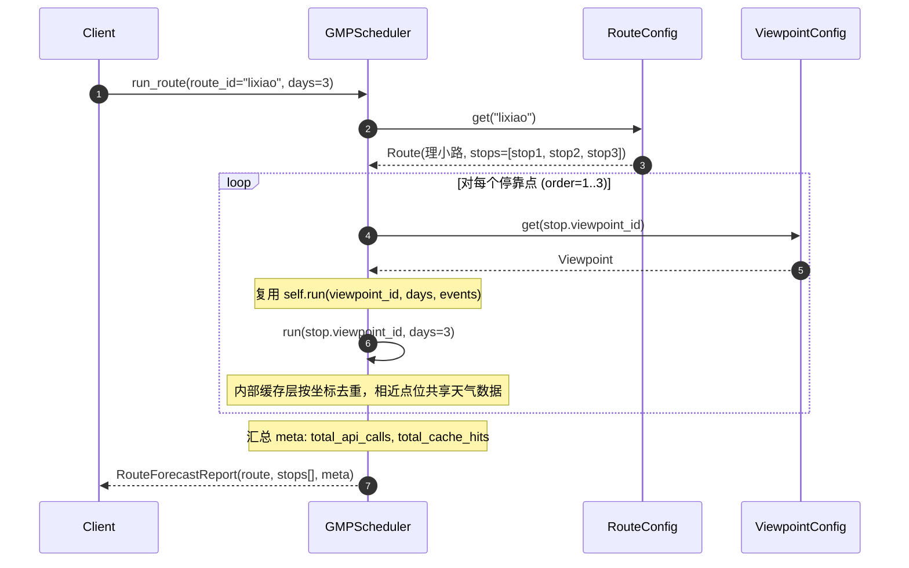

> [!NOTE]
> **缓存复用**: 线路上多个点位可能共享相同的天气数据缓存（坐标 ROUND(2) 后相同），
> 无需额外优化，现有缓存机制自然处理。

---

## 6.11 Backtester 类图

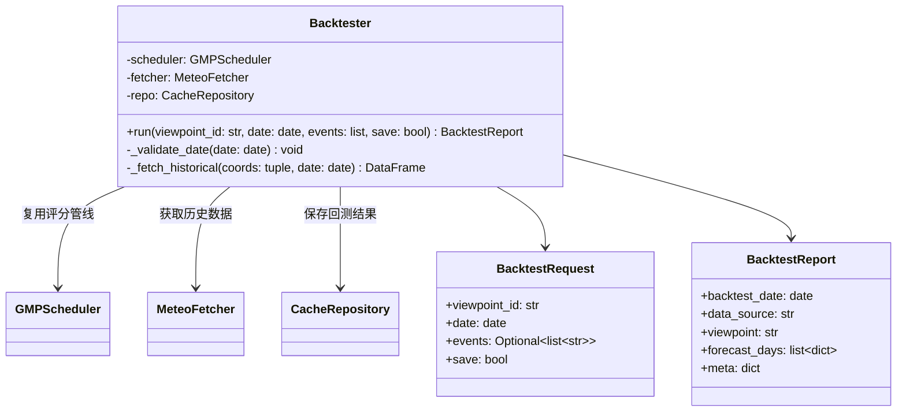

---

## 6.12 回测时序图

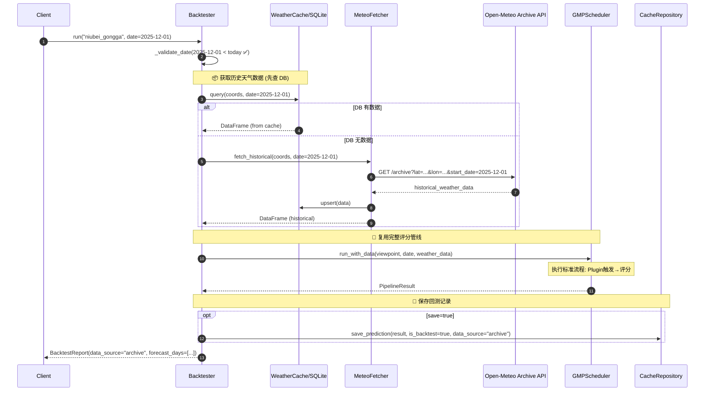

