# 6. 类图与时序图

## 6.1 核心类结构

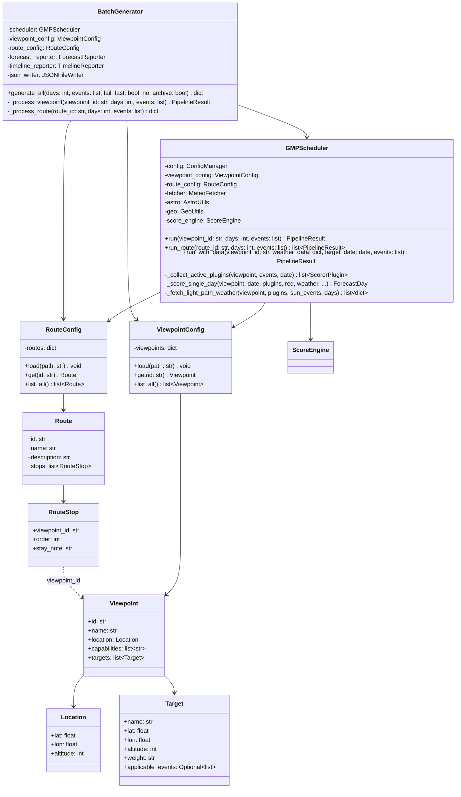
```mermaid
classDiagram
    class GMPScheduler {
        -config: ConfigManager
        -viewpoint_config: ViewpointConfig
        -route_config: RouteConfig
        -fetcher: MeteoFetcher
        -astro: AstroUtils
        -geo: GeoUtils
        -score_engine: ScoreEngine
        +run(viewpoint_id: str, days: int, events: list) PipelineResult
        +run_route(route_id: str, days: int, events: list) list~PipelineResult~
        +run_with_data(viewpoint_id: str, weather_data: dict, target_date: date, events: list) PipelineResult
        -_collect_active_plugins(viewpoint, events, date) list~ScorerPlugin~
        -_score_single_day(viewpoint, date, plugins, req, weather, ...) ForecastDay
        -_fetch_light_path_weather(viewpoint, plugins, sun_events, days) list~dict~
    }

    class BatchGenerator {
        -scheduler: GMPScheduler
        -viewpoint_config: ViewpointConfig
        -route_config: RouteConfig
        -forecast_reporter: ForecastReporter
        -timeline_reporter: TimelineReporter
        -json_writer: JSONFileWriter
        +generate_all(days: int, events: list, fail_fast: bool, no_archive: bool) dict
        -_process_viewpoint(viewpoint_id: str, days: int, events: list) PipelineResult
        -_process_route(route_id: str, days: int, events: list) dict
    }

    class ViewpointConfig {
        -viewpoints: dict
        +load(path: str) void
        +get(id: str) Viewpoint
        +list_all() list~Viewpoint~
    }

    class RouteConfig {
        -routes: dict
        +load(path: str) void
        +get(id: str) Route
        +list_all() list~Route~
    }

    class Route {
        +id: str
        +name: str
        +description: str
        +stops: list~RouteStop~
    }

    class RouteStop {
        +viewpoint_id: str
        +order: int
        +stay_note: str
    }

    class Viewpoint {
        +id: str
        +name: str
        +location: Location
        +capabilities: list~str~
        +targets: list~Target~
    }

    class Location {
        +lat: float
        +lon: float
        +altitude: int
    }

    class Target {
        +name: str
        +lat: float
        +lon: float
        +altitude: int
        +weight: str
        +applicable_events: Optional~list~
    }

    GMPScheduler --> ViewpointConfig
    GMPScheduler --> RouteConfig
    GMPScheduler --> ScoreEngine
    BatchGenerator --> GMPScheduler
    BatchGenerator --> ViewpointConfig
    BatchGenerator --> RouteConfig
    ViewpointConfig --> Viewpoint
    RouteConfig --> Route
    Route --> RouteStop
    RouteStop ..> Viewpoint : viewpoint_id
    Viewpoint --> Location
    Viewpoint --> Target
```

---

## 6.2 数据获取层 (含缓存层)

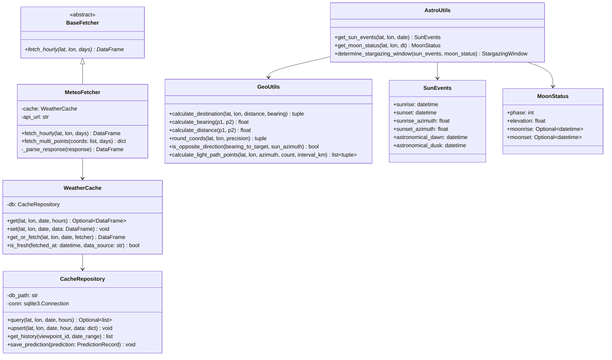
```mermaid
classDiagram
    class BaseFetcher {
        <<abstract>>
        +fetch_hourly(lat, lon, days)* DataFrame
    }

    class MeteoFetcher {
        -cache: WeatherCache
        -api_url: str
        +fetch_hourly(lat, lon, days) DataFrame
        +fetch_multi_points(coords: list, days) dict
        -_parse_response(response) DataFrame
    }

    class WeatherCache {
        -db: CacheRepository
        +get(lat, lon, date, hours) Optional~DataFrame~
        +set(lat, lon, date, data: DataFrame) void
        +get_or_fetch(lat, lon, date, fetcher) DataFrame
        +is_fresh(fetched_at: datetime, data_source: str) bool
    }

    class CacheRepository {
        -db_path: str
        -conn: sqlite3.Connection
        +query(lat, lon, date, hours) Optional~list~
        +upsert(lat, lon, date, hour, data: dict) void
        +get_history(viewpoint_id, date_range) list
        +save_prediction(prediction: PredictionRecord) void
    }

    class AstroUtils {
        +get_sun_events(lat, lon, date) SunEvents
        +get_moon_status(lat, lon, dt) MoonStatus
        +determine_stargazing_window(sun_events, moon_status) StargazingWindow
    }

    class GeoUtils {
        +calculate_destination(lat, lon, distance, bearing) tuple
        +calculate_bearing(p1, p2) float
        +calculate_distance(p1, p2) float
        +round_coords(lat, lon, precision) tuple
        +is_opposite_direction(bearing_to_target, sun_azimuth) bool
        +calculate_light_path_points(lat, lon, azimuth, count, interval_km) list~tuple~
    }

    class SunEvents {
        +sunrise: datetime
        +sunset: datetime
        +sunrise_azimuth: float
        +sunset_azimuth: float
        +astronomical_dawn: datetime
        +astronomical_dusk: datetime
    }

    class MoonStatus {
        +phase: int
        +elevation: float
        +moonrise: Optional~datetime~
        +moonset: Optional~datetime~
    }

    BaseFetcher <|-- MeteoFetcher
    MeteoFetcher --> WeatherCache
    WeatherCache --> CacheRepository
    AstroUtils --> GeoUtils
    AstroUtils --> SunEvents
    AstroUtils --> MoonStatus
```

---

## 6.3 分析层 (Plugin 架构)

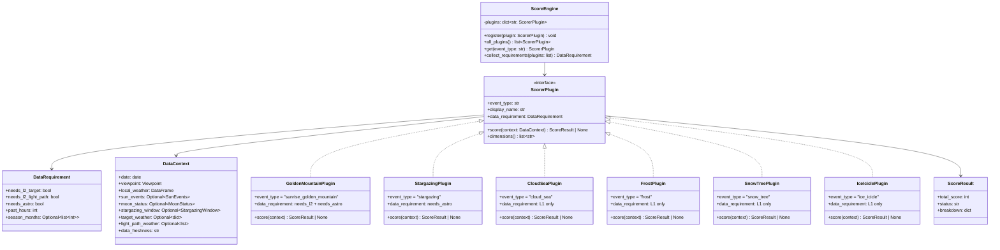
```mermaid
classDiagram
    class DataRequirement {
        +needs_l2_target: bool
        +needs_l2_light_path: bool
        +needs_astro: bool
        +past_hours: int
        +season_months: Optional~list~int~~
    }

    class DataContext {
        +date: date
        +viewpoint: Viewpoint
        +local_weather: DataFrame
        +sun_events: Optional~SunEvents~
        +moon_status: Optional~MoonStatus~
        +stargazing_window: Optional~StargazingWindow~
        +target_weather: Optional~dict~
        +light_path_weather: Optional~list~
        +data_freshness: str
    }

    class ScorerPlugin {
        <<interface>>
        +event_type: str
        +display_name: str
        +data_requirement: DataRequirement
        +score(context: DataContext) ScoreResult | None

        +dimensions() list~str~
    }

    class ScoreEngine {
        -plugins: dict~str, ScorerPlugin~
        +register(plugin: ScorerPlugin) void
        +all_plugins() list~ScorerPlugin~
        +get(event_type: str) ScorerPlugin
        +collect_requirements(plugins: list) DataRequirement
    }

    class GoldenMountainPlugin {
        +event_type = "sunrise_golden_mountain"
        +data_requirement: needs_l2 + needs_astro
        +score(context) ScoreResult | None

    }

    class StargazingPlugin {
        +event_type = "stargazing"
        +data_requirement: needs_astro
        +score(context) ScoreResult | None

    }

    class CloudSeaPlugin {
        +event_type = "cloud_sea"
        +data_requirement: L1 only
        +score(context) ScoreResult | None

    }

    class FrostPlugin {
        +event_type = "frost"
        +data_requirement: L1 only
        +score(context) ScoreResult | None

    }

    class SnowTreePlugin {
        +event_type = "snow_tree"
        +data_requirement: L1 only
        +score(context) ScoreResult | None

    }

    class IceIciclePlugin {
        +event_type = "ice_icicle"
        +data_requirement: L1 only
        +score(context) ScoreResult | None

    }

    class ScoreResult {
        +total_score: int
        +status: str
        +breakdown: dict
    }

    ScorerPlugin --> DataRequirement
    ScorerPlugin --> DataContext
    ScoreEngine --> ScorerPlugin
    ScorerPlugin <|.. GoldenMountainPlugin
    ScorerPlugin <|.. StargazingPlugin
    ScorerPlugin <|.. CloudSeaPlugin
    ScorerPlugin <|.. FrostPlugin
    ScorerPlugin <|.. SnowTreePlugin
    ScorerPlugin <|.. IceIciclePlugin
    ScorerPlugin --> ScoreResult
```

> [!NOTE]
> **扩展新景观**: 只需实现 `ScorerPlugin` 接口并调用 `engine.register(NewPlugin())`，Scheduler 无需任何改动。

---

## 6.4 输出层

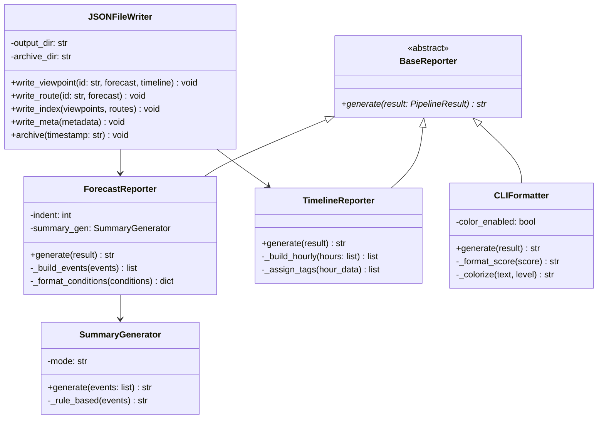
```mermaid
classDiagram
    class BaseReporter {
        <<abstract>>
        +generate(result: PipelineResult)* str
    }

    class ForecastReporter {
        -indent: int
        -summary_gen: SummaryGenerator
        +generate(result) str
        -_build_events(events) list
        -_format_conditions(conditions) dict
    }

    class TimelineReporter {
        +generate(result) str
        -_build_hourly(hours: list) list
        -_assign_tags(hour_data) list
    }

    class SummaryGenerator {
        -mode: str
        +generate(events: list) str
        -_rule_based(events) str
    }

    class CLIFormatter {
        -color_enabled: bool
        +generate(result) str
        -_format_score(score) str
        -_colorize(text, level) str
    }

    class JSONFileWriter {
        -output_dir: str
        -archive_dir: str
        +write_viewpoint(id: str, forecast, timeline) void
        +write_route(id: str, forecast) void
        +write_index(viewpoints, routes) void
        +write_meta(metadata) void
        +archive(timestamp: str) void
    }

    BaseReporter <|-- ForecastReporter
    BaseReporter <|-- TimelineReporter
    BaseReporter <|-- CLIFormatter
    ForecastReporter --> SummaryGenerator
    JSONFileWriter --> ForecastReporter
    JSONFileWriter --> TimelineReporter
```

---

## 6.5 主流程时序图 — 7天预报生成 (Plugin 驱动)

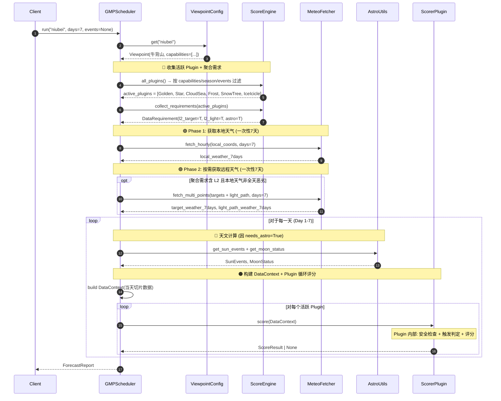
```mermaid
sequenceDiagram
    autonumber
    participant C as Client
    participant S as GMPScheduler
    participant VC as ViewpointConfig
    participant SE as ScoreEngine
    participant MF as MeteoFetcher
    participant AU as AstroUtils
    participant P as ScorerPlugin

    C->>S: run("niubei", days=7, events=None)
    S->>VC: get("niubei")
    VC-->>S: Viewpoint(牛背山, capabilities=[...])

    Note over S,SE: 🔵 收集活跃 Plugin + 聚合需求
    S->>SE: all_plugins() → 按 capabilities/season/events 过滤
    SE-->>S: active_plugins = [Golden, Star, CloudSea, Frost, SnowTree, IceIcicle]
    S->>SE: collect_requirements(active_plugins)
    SE-->>S: DataRequirement(l2_target=T, l2_light=T, astro=T)

    Note over S,MF: 🟢 Phase 1: 获取本地天气 (一次性7天)
    S->>MF: fetch_hourly(local_coords, days=7)
    MF-->>S: local_weather_7days

    Note over S,MF: 🟢 Phase 2: 按需获取远程天气 (一次性7天)
    opt 聚合需求含 L2 且本地天气非全天恶劣
        S->>MF: fetch_multi_points(targets + light_path, days=7)
        MF-->>S: target_weather_7days, light_path_weather_7days
    end

    loop 对于每一天 (Day 1-7)
        Note over S,AU: 📐 天文计算 (因 needs_astro=True)
        S->>AU: get_sun_events + get_moon_status
        AU-->>S: SunEvents, MoonStatus

        Note over S,P: 🟠 构建 DataContext + Plugin 循环评分
        S->>S: build DataContext(当天切片数据)
        loop 对每个活跃 Plugin
            S->>P: score(DataContext)
            Note over P: Plugin 内部: 安全检查 + 触发判定 + 评分
            P-->>S: ScoreResult | None
        end
    end

    S-->>C: ForecastReport
```

---

## 6.6 缓存与降级流程

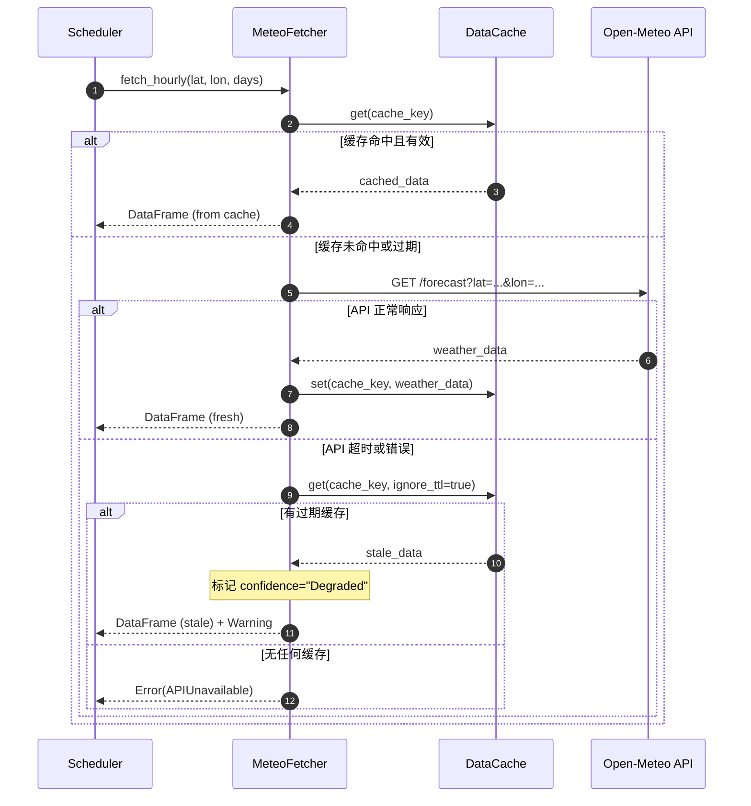
```mermaid
sequenceDiagram
    autonumber
    participant S as Scheduler
    participant MF as MeteoFetcher
    participant C as DataCache
    participant API as Open-Meteo API

    S->>MF: fetch_hourly(lat, lon, days)
    
    MF->>C: get(cache_key)
    
    alt 缓存命中且有效
        C-->>MF: cached_data
        MF-->>S: DataFrame (from cache)
    else 缓存未命中或过期
        MF->>API: GET /forecast?lat=...&lon=...
        
        alt API 正常响应
            API-->>MF: weather_data
            MF->>C: set(cache_key, weather_data)
            MF-->>S: DataFrame (fresh)
        else API 超时或错误
            MF->>C: get(cache_key, ignore_ttl=true)
            alt 有过期缓存
                C-->>MF: stale_data
                Note over MF: 标记 confidence="Degraded"
                MF-->>S: DataFrame (stale) + Warning
            else 无任何缓存
                MF-->>S: Error(APIUnavailable)
            end
        end
    end
```

---

## 6.7 云海评分流程

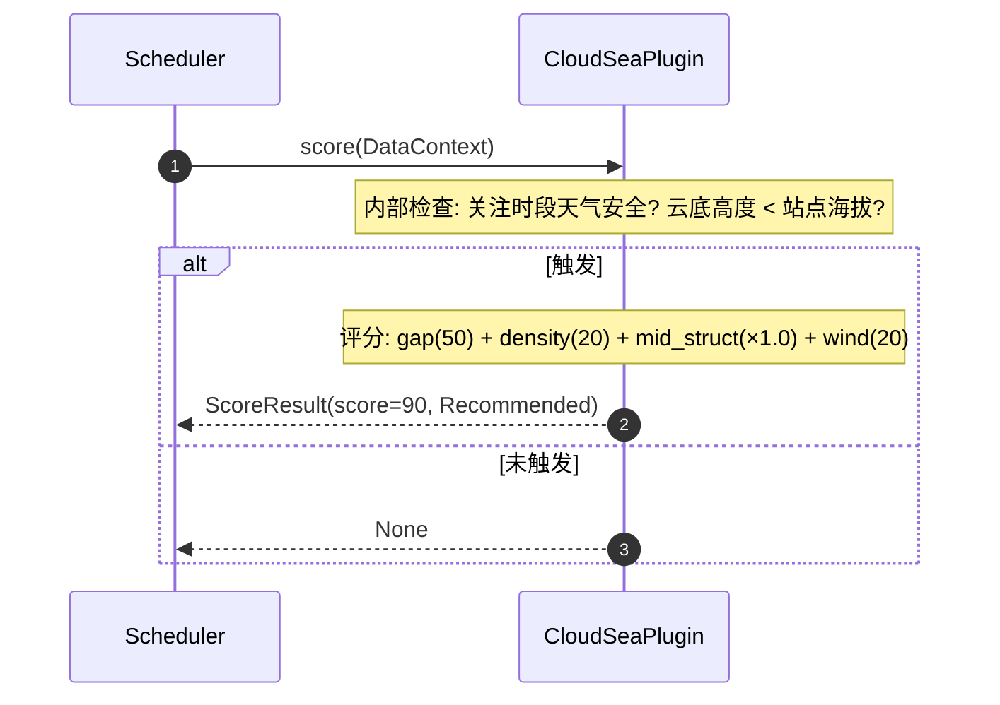
```mermaid
sequenceDiagram
    autonumber
    participant S as Scheduler
    participant P as CloudSeaPlugin

    S->>P: score(DataContext)
    Note over P: 内部检查: 关注时段天气安全? 云底高度 < 站点海拔?
    alt 触发
        Note over P: 评分: gap(50) + density(20) + mid_struct(×1.0) + wind(20)
        P-->>S: ScoreResult(score=90, Recommended)
    else 未触发
        P-->>S: None
    end
```

---

## 6.8 雾凇评分流程

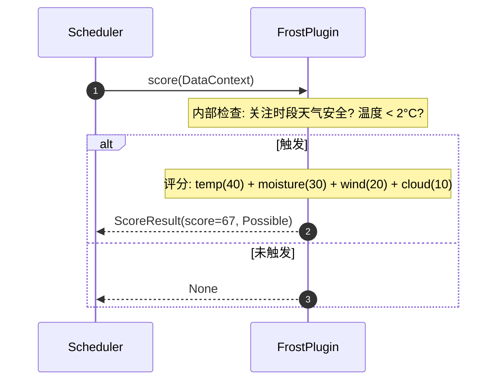
```mermaid
sequenceDiagram
    autonumber
    participant S as Scheduler
    participant P as FrostPlugin

    S->>P: score(DataContext)
    Note over P: 内部检查: 关注时段天气安全? 温度 < 2°C?
    alt 触发
        Note over P: 评分: temp(40) + moisture(30) + wind(20) + cloud(10)
        P-->>S: ScoreResult(score=67, Possible)
    else 未触发
        P-->>S: None
    end
```

---

## 6.9 赏雪评分流程 (留存场景)

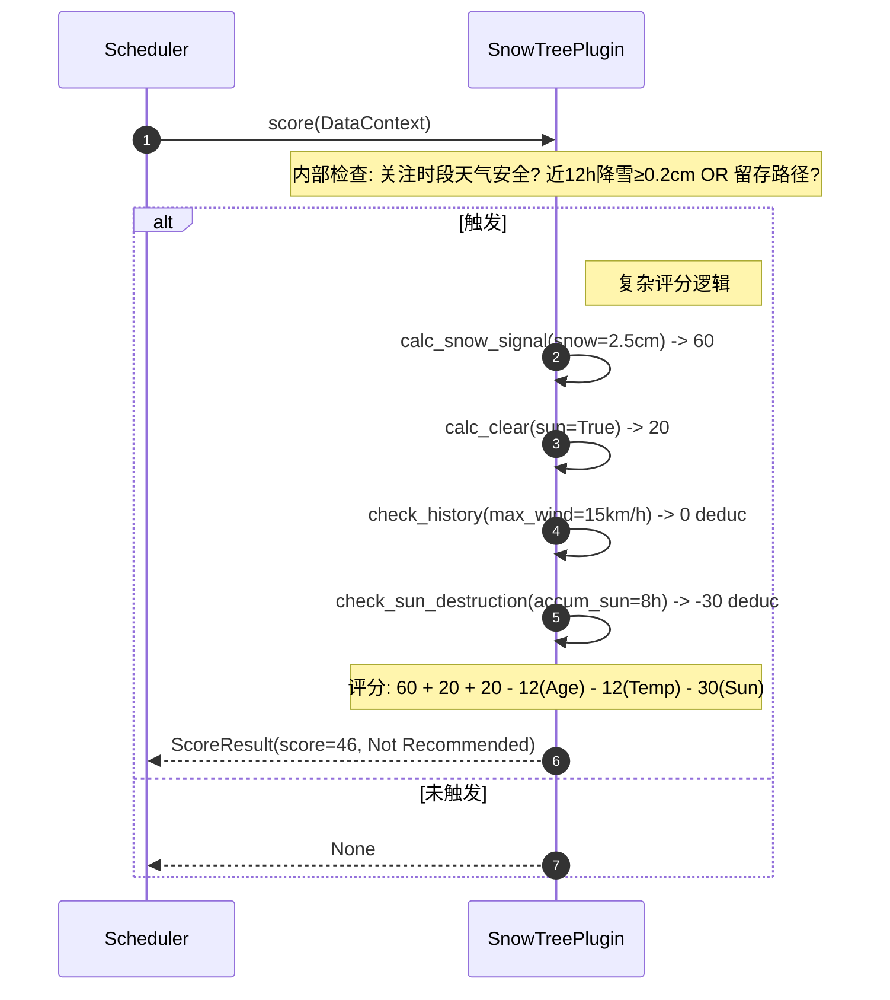
```mermaid
sequenceDiagram
    autonumber
    participant S as Scheduler
    participant P as SnowTreePlugin

    S->>P: score(DataContext)
    Note over P: 内部检查: 关注时段天气安全? 近12h降雪≥0.2cm OR 留存路径?
    alt 触发
        Note right of P: 复杂评分逻辑
        P->>P: calc_snow_signal(snow=2.5cm) -> 60
        P->>P: calc_clear(sun=True) -> 20
        P->>P: check_history(max_wind=15km/h) -> 0 deduc
        P->>P: check_sun_destruction(accum_sun=8h) -> -30 deduc
        Note over P: 评分: 60 + 20 + 20 - 12(Age) - 12(Temp) - 30(Sun)
        P-->>S: ScoreResult(score=46, Not Recommended)
    else 未触发
        P-->>S: None
    end
```

---

## 6.10 线路预测时序图 — Route Forecast

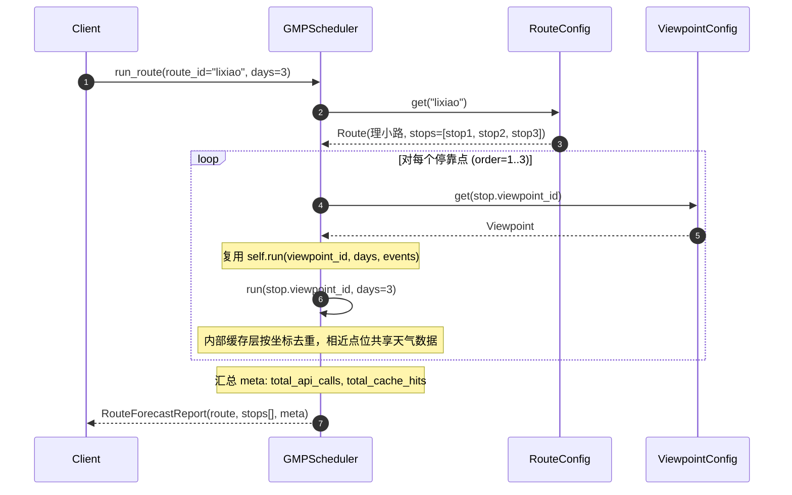
```mermaid
sequenceDiagram
    autonumber
    participant C as Client
    participant S as GMPScheduler
    participant RC as RouteConfig
    participant VC as ViewpointConfig

    C->>S: run_route(route_id="lixiao", days=3)
    S->>RC: get("lixiao")
    RC-->>S: Route(理小路, stops=[stop1, stop2, stop3])

    loop 对每个停靠点 (order=1..3)
        S->>VC: get(stop.viewpoint_id)
        VC-->>S: Viewpoint
        Note over S: 复用 self.run(viewpoint_id, days, events)
        S->>S: run(stop.viewpoint_id, days=3)
        Note over S: 内部缓存层按坐标去重，相近点位共享天气数据
    end

    Note over S: 汇总 meta: total_api_calls, total_cache_hits
    S-->>C: RouteForecastReport(route, stops[], meta)
```

> [!NOTE]
> **缓存复用**: 线路上多个点位可能共享相同的天气数据缓存（坐标 ROUND(2) 后相同），
> 无需额外优化，现有缓存机制自然处理。

---

## 6.11 Backtester 类图

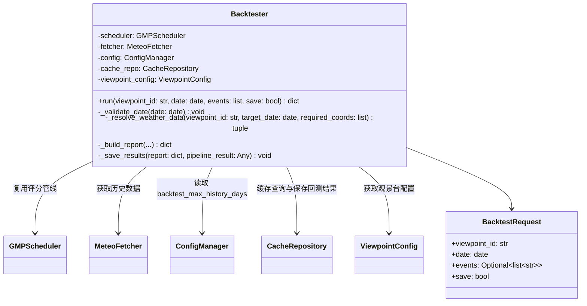
```mermaid
classDiagram
    class Backtester {
        -scheduler: GMPScheduler
        -fetcher: MeteoFetcher
        -config: ConfigManager
        -cache_repo: CacheRepository
        -viewpoint_config: ViewpointConfig
        +run(viewpoint_id: str, date: date, events: list, save: bool) dict
        -_validate_date(date: date) void
        -_resolve_weather_data(viewpoint_id: str, target_date: date, required_coords: list) tuple
        -_build_report(...) dict
        -_save_results(report: dict, pipeline_result: Any) void
    }

    class BacktestRequest {
        +viewpoint_id: str
        +date: date
        +events: Optional~list~str~~
        +save: bool
    }

    Backtester --> GMPScheduler : 复用评分管线
    Backtester --> MeteoFetcher : 获取历史数据
    Backtester --> ConfigManager : 读取 backtest_max_history_days
    Backtester --> CacheRepository : 缓存查询与保存回测结果
    Backtester --> ViewpointConfig : 获取观景台配置
    Backtester --> BacktestRequest
```

> [!NOTE]
> Backtester.run() 返回 dict 而非 dataclass，便于灵活序列化。报告格式包含 `viewpoint_id, target_date, is_backtest, data_source, events, meta` 等字段。

---

## 6.12 回测时序图

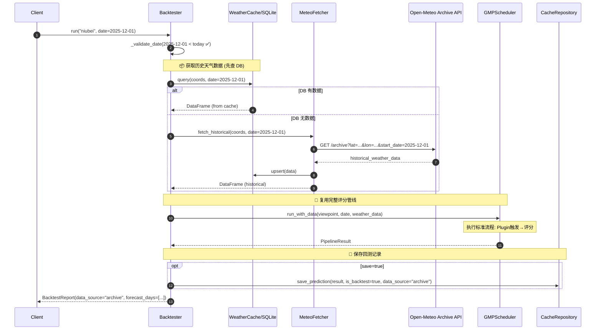
```mermaid
sequenceDiagram
    autonumber
    participant C as Client
    participant B as Backtester
    participant Cache as WeatherCache/SQLite
    participant MF as MeteoFetcher
    participant API as Open-Meteo Archive API
    participant S as GMPScheduler
    participant R as CacheRepository

    C->>B: run("niubei", date=2025-12-01)
    B->>B: _validate_date(2025-12-01 < today ✅)
    
    Note over B,Cache: 📦 获取历史天气数据 (先查 DB)
    B->>Cache: query(coords, date=2025-12-01)
    alt DB 有数据
        Cache-->>B: DataFrame (from cache)
    else DB 无数据
        B->>MF: fetch_historical(coords, date=2025-12-01)
        MF->>API: GET /archive?lat=...&lon=...&start_date=2025-12-01
        API-->>MF: historical_weather_data
        MF->>Cache: upsert(data)
        MF-->>B: DataFrame (historical)
    end

    Note over B,S: 🔄 复用完整评分管线
    B->>S: run_with_data(viewpoint, date, weather_data)
    Note over S: 执行标准流程: Plugin触发→评分
    S-->>B: PipelineResult

    Note over B,R: 💾 保存回测记录
    opt save=true
        B->>R: save_prediction(result, is_backtest=true, data_source="archive")
    end

    B-->>C: BacktestReport(data_source="archive", forecast_days=[...])
```

