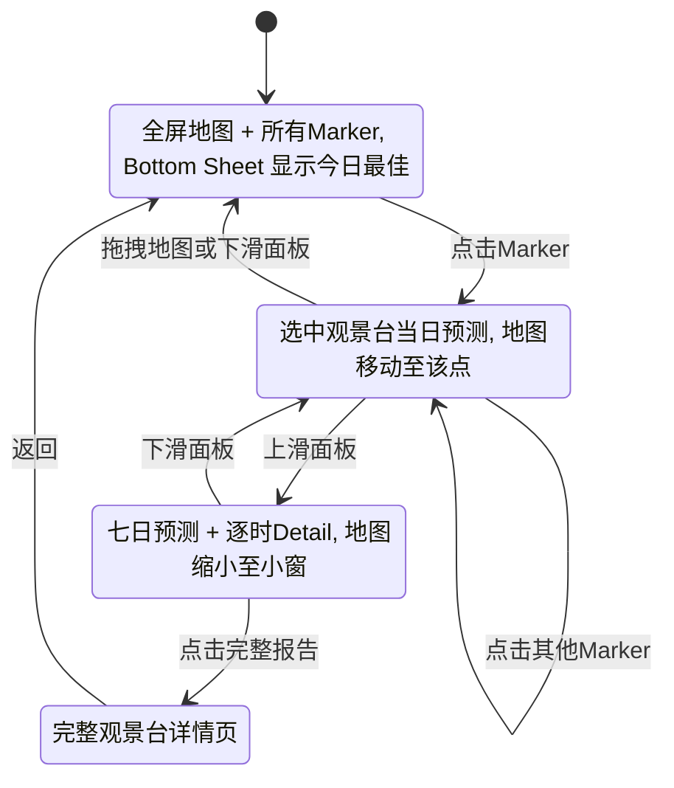
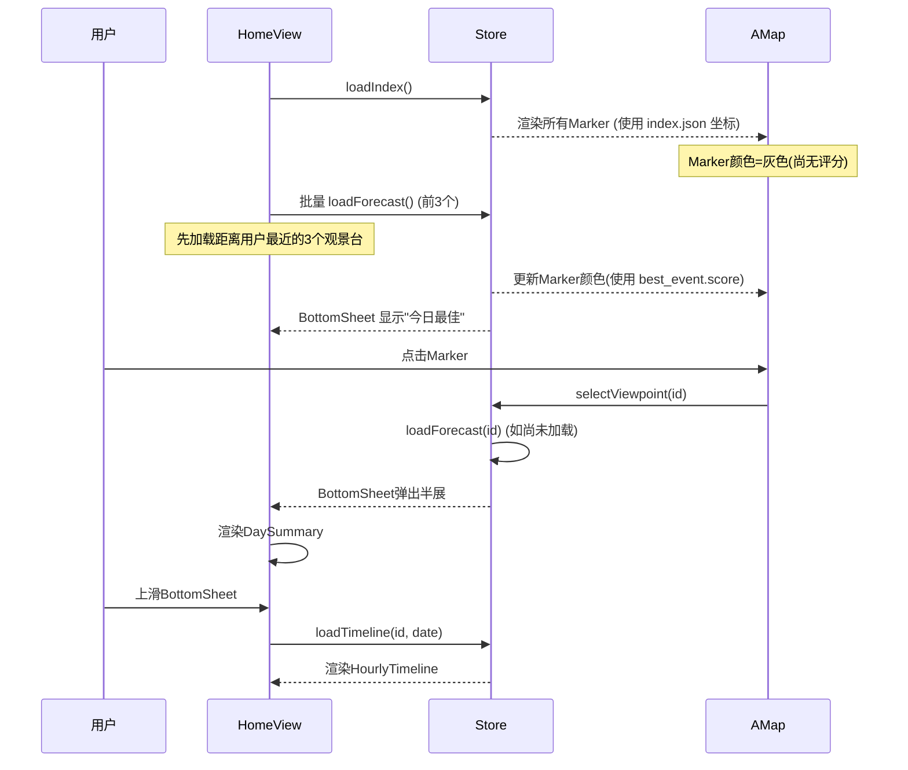

# 10-A. 沉浸地图方案 (Immersive Map)

> **核心理念:** 地图即一切。用户通过地图探索川西各观景台位置，所有信息通过 Bottom Sheet 面板渐进展示。
>
> 公共组件依赖 [10-frontend-common.md](./10-frontend-common.md)，总体需求见 [10-frontend.md](./10-frontend.md)。

---

## 10.A.1 方案概述

| 维度 | 说明 |
|------|------|
| **核心逻辑** | 地理位置驱动，点击地图标记获取信息 |
| **典型参照** | Google Maps / Apple Maps / 高德App |
| **信息密度** | 低密度——一次只聚焦一个观景台 |
| **适用用户** | 熟悉川西地理、喜欢探索的用户 |
| **截图优势** | 地图总览图天然适合小红书首图 |

---

## 10.A.2 页面结构

### 竖屏布局 (Mobile-First)

```
┌────────────────────────────┐
│ 🔍 搜索 / 筛选  📅 日期    │  ← 悬浮顶栏 (透明背景，毛玻璃)
│                            │
│                            │
│       全   屏   地   图     │  ← 高德地图 / 可缩放拖拽
│   ●98 牛背山               │  ← 彩色标记点
│              ●45 折多山     │
│     ●90 磐羊湖             │
│                            │
│                            │
│                            │
├────────────────────────────┤
│  ≡ 今日最佳推荐            │  ← Bottom Sheet (默认 ~20%)
│  🏔️ 牛背山 98分 → 日出金山 │
│  ☁️ 磐羊湖 90分 → 云海     │
└────────────────────────────┘
```

### Bottom Sheet 三级高度

| 状态 | 高度 | 触发 | 内容 |
|------|------|------|------|
| **收起** | 20% | 默认 / 拖拽回 | 今日最佳推荐列表 (最多3项，按 best_event.score 排序) |
| **半展** | 45% | 点击 Marker | 选中观景台的**当日预测概览** (DaySummary + EventList) |
| **全展** | 90% | 上滑面板 / 点击"查看详情" | 选中观景台的**七日预测** (WeekTrend + 日期选择器 + HourlyTimeline) |

### 横屏布局 (Desktop)

```
┌──────────────────────┬──────────────────┐
│                      │  牛背山 预测详情   │
│                      │  ═══════════════  │
│     全 屏 地 图       │  📅 2月12日       │
│                      │  🏔️ 日出金山 90分  │
│   ● 牛背山           │  ☁️ 云海 88分      │
│              ● 折多  │  ────────────────  │
│                      │  七日趋势图        │
│                      │  [图表]            │
└──────────────────────┴──────────────────┘
         65%                   35%
```

---

## 10.A.3 交互逻辑

### 流程图



### 关键交互

| 操作 | 行为 |
|------|------|
| **点击 Marker** | 地图 `flyTo` 至该点 (800ms 动画)，Bottom Sheet 弹至半展，展示 `DaySummary` |
| **上滑面板** | Bottom Sheet 扩展至全展，显示 `WeekTrend` + `HourlyTimeline`；地图面积缩小但保持可见 |
| **拖拽地图** | Bottom Sheet 自动回收至收起状态 |
| **点击面板内"查看完整报告"** | Vue Router 导航至 `/viewpoint/:id`，全屏详情页 |
| **双指缩放地图** | 缩放至合适级别后显示/隐藏不同密度的 Marker |
| **点击日期 (面板内)** | 切换 `selectedDate`，联动 `DaySummary` + `HourlyTimeline` 数据 |
| **搜索框输入** | 模糊匹配观景台名称，高亮匹配 Marker，地图 `flyTo` |

---

## 10.A.4 Marker 设计

### 三种状态

**默认 Marker:**
```
    ┌──────────┐
    │ 🏔️ 98   │  ← 圆角矩形，背景色 = useScoreColor(score)
    └──────────┘
         ▼        ← 三角箭头指向地理坐标
```

**选中 Marker:**
```
    ┌──────────────┐
    │  牛 背 山     │  ← 名称展开
    │  🏔️ 98 推荐  │  ← 评分 + 状态
    └──────────────┘
          ▼
```
- 弹跳动画 (bounce)
- 白色外描边发光
- Z-index 提升到最顶层

**缩略 Marker (远距缩放):**
```
    ●  ← 仅圆点，颜色 = useScoreColor(score)
```
- zoom < 9 时切换为缩略模式
- 避免大量标记重叠

### Marker 聚类

当 zoom 较低时，使用高德地图的 MarkerCluster 插件，将临近标记聚合为：
```
    ┌────────┐
    │  5个点  │  ← 显示聚合数量
    │  最高92│  ← 显示最高分
    └────────┘
```

---

## 10.A.5 顶部搜索/筛选栏

### 功能

| 元素 | 说明 |
|------|------|
| **搜索框** | 模糊搜索观景台名称 (如"牛背"→ 牛背山) |
| **事件筛选** | 多选 Chip: 金山 / 云海 / 观星 / 雾凇，筛选 Marker 只显示具备该能力的 |
| **日期切换** | 左右/选择日期，切换所有 Marker 对应日期的评分颜色 |
| **线路按钮** | 一键切换"线路模式"，在地图上展示 RouteLine |

### 视觉风格

```
┌─────────────────────────────────────────┐
│  🔍 搜索观景台  │ 🏔️ ☁️ ⭐ ❄️ │ 📅 2/12 │  ← 毛玻璃背景
└─────────────────────────────────────────┘
```

- `backdrop-filter: blur(12px)`
- 半透明白底
- 圆角 `var(--radius-lg)`

---

## 10.A.6 线路模式

当用户点击"线路"按钮时：

1. **地图画线:** 在 Marker 之间绘制 `AMap.Polyline` (虚线+箭头)
2. **Bottom Sheet 切换:** 显示线路详情，各站按 order 排列
3. **联动:** 点击某站，地图飞至该站，面板滚动至该站

```
┌────────────────────────────────┐
│  ≡ 理小路 (2站)                │
│  ────────────────────────────  │
│  1. 折多山    75分 🏔️          │
│     建议停留2小时观赏日出金山    │
│  ────────────────────────────  │
│  2. 牛背山    90分 🏔️ ☁️       │
│     建议停留3小时，金山+云海组合 │
└────────────────────────────────┘
```

---

## 10.A.7 截图场景

### "地图总览"截图

用于小红书首图——一眼看遍全部观景台：

**触发:** 顶栏右侧 📸 按钮 → 短暂隐藏 Bottom Sheet + 搜索栏 → 截图 → 恢复

**截图区域:** 全屏地图 + Marker（含评分数字）+ 右下角 GMP Logo 水印

### "单站预测"截图

Bottom Sheet 全展状态时，截取面板为图片：

**截图区域:** Bottom Sheet 内容 (DaySummary + WeekTrend)

---

## 10.A.8 特有动画

| 动画 | 效果 | 时机 |
|------|------|------|
| **Marker 入场** | 从地面"弹起" (spring) | 页面初始化 |
| **FlyTo 过渡** | 地图飞行 + 缩放 | 点击 Marker / 搜索结果 |
| **Bottom Sheet 滑动** | 手指跟随 + 回弹 | 拖拽面板顶部 handle |
| **评分数字滚动** | CountUp 数字增长 | 切换观景台 / 日期 |
| **Marker 脉冲** | 选中 Marker 外圈水波纹 | 选中状态持续 |

---

## 10.A.9 组件树 (方案特有)

```
App.vue
└── HomeView.vue (方案A首页)
    ├── MapTopBar.vue          # 搜索 + 筛选 + 日期
    ├── AMapContainer.vue      # 全屏地图 [公共]
    │   ├── ViewpointMarker.vue × N   [公共]
    │   └── RouteLine.vue      [公共]
    ├── BottomSheet.vue        # ★ 方案A核心组件 ★
    │   ├── BestRecommendList.vue    # 收起态: 今日最佳列表
    │   ├── DaySummary.vue     [公共]
    │   ├── EventList.vue      [公共]
    │   ├── WeekTrend.vue      [公共]
    │   └── HourlyTimeline.vue [公共]
    └── ScreenshotBtn.vue      [公共]
```

### 方案 A 专有组件

| 组件 | 用途 |
|------|------|
| `BottomSheet.vue` | 三级高度面板，手势拖拽，手指跟随 |
| `BestRecommendList.vue` | 收起态展示今日最佳推荐 (≤3 项) |
| `MapTopBar.vue` | 毛玻璃搜索筛选栏 |

---

## 10.A.10 数据加载时序 (方案特有)



> [!TIP]
> **懒加载策略:** 首次仅加载 `index.json` + 离用户最近的 3 个观景台的 `forecast.json`。其余观景台在用户点击 Marker 时按需加载，减少首屏请求数。

