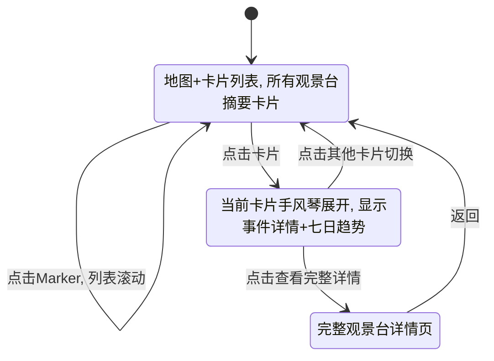
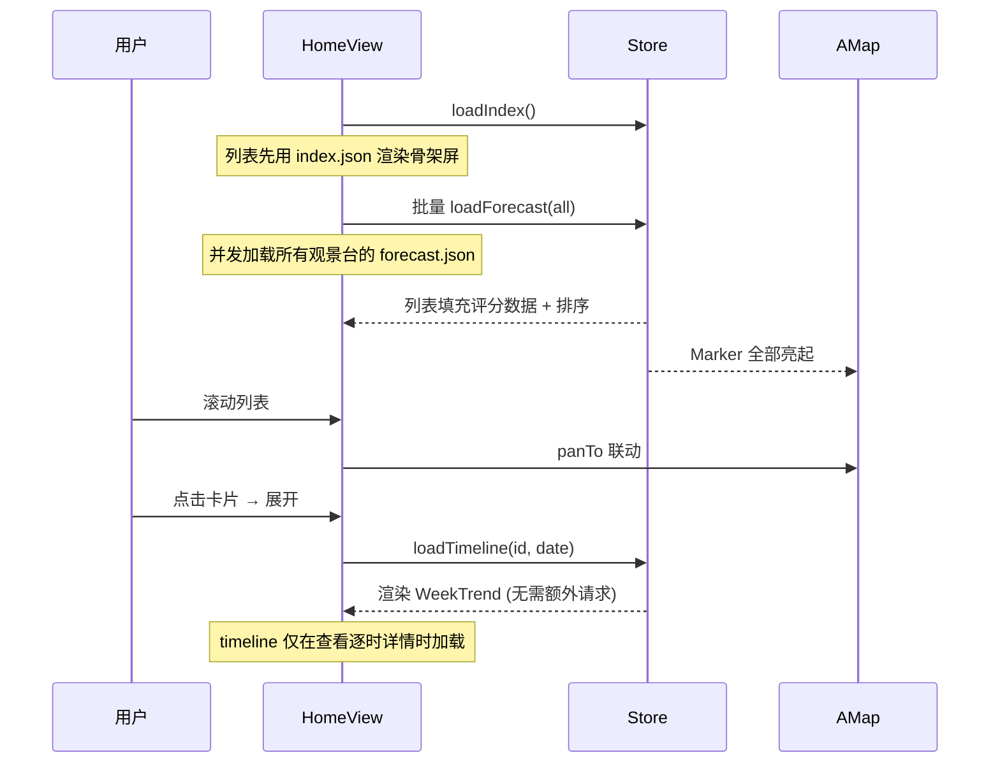

# 10-B. 分屏浏览方案 (Split List)

> **核心理念:** 列表优先，效率为王。用户通过滚动列表快速对比多个观景台的评分，地图作为辅助定位工具联动展示。
>
> 公共组件依赖 [10-frontend-common.md](./10-frontend-common.md)，总体需求见 [10-frontend.md](./10-frontend.md)。

---

## 10.B.1 方案概述

| 维度 | 说明 |
|------|------|
| **核心逻辑** | 列表驱动浏览，地图辅助定位 |
| **典型参照** | Airbnb / 携程酒店列表 / 大众点评 |
| **信息密度** | 高密度——一屏可见 3~5 个观景台摘要 |
| **适用用户** | 需要快速对比多个观景台、做出出行决策的用户 |
| **截图优势** | 列表截图天然适合"多地对比"类小红书帖子 |

---

## 10.B.2 页面结构

### 竖屏布局 (Mobile-First)

```
┌────────────────────────────┐
│ 📅 2月12日  🔍  🏔️☁️⭐❄️   │  ← 顶部固定栏: 日期 + 搜索 + 筛选
├────────────────────────────┤
│                            │
│    地 图 区 域 (35%)        │  ← 固定高度地图，显示所有Marker
│       ● 牛背山             │     当前Marker高亮
│              ● 折多山       │
│                            │
├══ ≡ 拖拽调整比例 ═══════════┤  ← 可选: 拖拽条调整分割比例
│                            │
│  ┌──────────────────────┐  │  ← 预测卡片列表 (65%)
│  │ 🏔️ 牛背山    98分     │  │     滚动浏览
│  │ 日出金山+云海 推荐     │  │
│  │ 信心度: 高  ☁️90 ⭐45 │  │
│  └──────────────────────┘  │
│  ┌──────────────────────┐  │
│  │ ☁️ 磐羊湖    90分     │  │
│  │ 云海  推荐            │  │
│  │ 信心度: 中等           │  │
│  └──────────────────────┘  │
│  ┌──────────────────────┐  │
│  │ 🏔️ 折多山    75分     │  │
│  │ 日出金山 条件一般      │  │
│  └──────────────────────┘  │
│         ...                │
└────────────────────────────┘
```

### 横屏布局 (Desktop)

```
┌─────────────────────┬───────────────────────────┐
│                     │  📅 2月12日  🔍 搜索       │
│                     │  🏔️ ☁️ ⭐ ❄️ │ 排序 ▼    │
│   地 图 区 域        ├───────────────────────────┤
│    (40%)            │                           │
│                     │  ┌───────────────────────┐│
│  ● 牛背山            │  │ 🏔️ 牛背山  98分 推荐  ││
│         ● 磐羊湖     │  │ 日出金山+云海         ││
│                     │  └───────────────────────┘│
│              ● 折多  │  ┌───────────────────────┐│
│                     │  │ ☁️ 磐羊湖  90分 推荐   ││
│                     │  │ 云海                   ││
│                     │  └───────────────────────┘│
│                     │  ┌───────────────────────┐│
│                     │  │ ⭐ 达古冰川 68分 一般  ││
│                     │  │ 观星                   ││
│                     │  └───────────────────────┘│
└─────────────────────┴───────────────────────────┘
```

---

## 10.B.3 交互逻辑

### 流程图



### 列表↔地图联动

| 操作 | 列表行为 | 地图行为 |
|------|----------|----------|
| **滚动列表** | 当前可见的**首个卡片**为焦点 | 地图 `panTo` 至焦点观景台，高亮该 Marker |
| **点击地图 Marker** | 列表 `scrollIntoView` 至对应卡片 | Marker 选中态 |
| **点击卡片** | 卡片展开（手风琴） | 地图 `flyTo` 至对应点位 |
| **日期切换** | 所有卡片数据更新 | 所有 Marker 评分颜色更新 |
| **筛选事件** | 列表只显示支持该事件的观景台 | 地图只显示匹配 Marker |

### Intersection Observer 联动

使用 Intersection Observer API 监测列表中可见的卡片：

```javascript
// 伪代码
const observer = new IntersectionObserver((entries) => {
  const visibleCard = entries.find(e => e.isIntersecting)
  if (visibleCard) {
    store.highlightViewpoint(visibleCard.target.dataset.viewpointId)
    map.panTo(visibleCard.target.dataset.coordinates)
  }
}, { threshold: 0.6 })
```

---

## 10.B.4 列表卡片设计

### 收起状态 (默认)

```
┌──────────────────────────────────────────┐
│  ScoreRing(90)  牛背山              ❯    │
│                 🏔️日出金山 ☁️云海          │
│                 日出金山+壮观云海 推荐     │
│                 信心度: 高   2/12 周三    │
│  ┌──────┬──────┬──────┬──────┐          │
│  │🏔️ 90│☁️ 88│⭐ 45│❄️ --│          │
│  └──────┴──────┴──────┴──────┘          │
└──────────────────────────────────────────┘
```

**设计要素:**
- 左侧: `ScoreRing(lg)` 展示 best_event.score
- 右侧: 观景台名称 + 当日 summary + 所有事件的缩略评分
- 底部: 所有事件的 mini 图标 + 分数一行展示 (快速对比)
- 右上角: 展开箭头 `❯`

### 展开状态 (手风琴)

```
┌──────────────────────────────────────────┐
│  ScoreRing(90)  牛背山          组合日 🎯│
│                 日出金山+壮观云海           │
├──────────────────────────────────────────┤
│  事件详情                                 │
│  ┌────────────────────────────────────┐  │
│  │ 🏔️ 日出金山  90分  High           │  │
│  │ 07:15-07:45  推荐                  │  │
│  │ 光路:35/35  目标:35/40  本地:20/25 │  │
│  └────────────────────────────────────┘  │
│  ┌────────────────────────────────────┐  │
│  │ ☁️ 云海      88分  High           │  │
│  │ 06:00-09:00  推荐                  │  │
│  │ 间距:50/50  密度:20/30  风:18/20   │  │
│  └────────────────────────────────────┘  │
├──────────────────────────────────────────┤
│  七日趋势 [WeekTrend 折线图]              │
│  ╱╲     ╱╲                              │
│ ╱  ╲   ╱  ╲                             │
│╱    ╲╱╱    ╲                             │
│ 12 13 14 15 16 17 18                     │
├──────────────────────────────────────────┤
│  [查看完整详情 →]                         │
└──────────────────────────────────────────┘
```

**展开内容:**
1. **EventCard × N** — 各事件详情 (含 `BreakdownTable` 简化版)
2. **WeekTrend** — 七日趋势折线图 (点击某日可切换)
3. **操作按钮** — "查看完整详情" 导航至详情页

展开动画: `max-height` + `opacity` 过渡，300ms ease-out

---

## 10.B.5 排序与筛选

### 排序选项

| 排序方式 | 逻辑 |
|----------|------|
| **推荐 (默认)** | `best_event.score` 降序，无事件的排最后 |
| **名称** | 按 `viewpoint_name` 中文拼音排序 |
| **距离** | 按离用户当前位置距离排序 (需定位权限) |

### 筛选选项

| 筛选类型 | UI | 逻辑 |
|----------|------|------|
| **事件类型** | 多选 Chip `🏔️ ☁️ ⭐ ❄️` | 只显示 capabilities 包含选中类型的观景台 |
| **评分门槛** | 滑块 0-100 | 只显示 best_event.score ≥ 门槛的观景台 |
| **状态过滤** | 按钮组: 推荐/可能/全部 | 按 status 筛选 |

---

## 10.B.6 拖拽分割条

### 设计细节

- 地图与列表之间的分割条，中间有 `≡` 拖拽手柄
- 可拖拽范围: 地图最小 20%、最大 60%
- 双击分割条: 恢复默认 35%/65% 比例
- 记忆用户偏好 (localStorage)

### 快捷操作

| 操作 | 效果 |
|------|------|
| **向上拖至极限** | 地图隐藏，变为纯列表模式 (上方出现"显示地图"按钮) |
| **向下拖至极限** | 列表隐藏，变为纯地图模式 (类似方案A) |
| **双击** | 恢复默认比例 |

---

## 10.B.7 线路模式

列表视图下的线路展示：

### 线路卡片

当用户切换到"线路"标签时，列表替换为线路列表：

```
┌──────────────────────────────────────────┐
│  理小路 (2站)                    📅 2/12 │
├──────────────────────────────────────────┤
│  ① 折多山  ──────→  ② 牛背山            │
│    🏔️ 75            🏔️☁️ 90             │
│    停留2h            停留3h               │
├──────────────────────────────────────────┤
│  最佳停靠建议: 牛背山 (90分) → 云海+金山  │
└──────────────────────────────────────────┘
```

- 地图同步绘制 RouteLine
- 点击某一站，等同于点击该观景台卡片

---

## 10.B.8 截图场景

### "排行榜"截图

最适合本方案的截图类型——多地对比一目了然：

**截图区域:** 列表区域 (含顶部日期标题)  
**触发:** 列表顶部 📸 按钮  
**效果:** 自动滚动至顶部 → 截取前 5 个卡片 → 生成图片

**生成结果示例:**
```
┌──────────────────────────────┐
│  2月12日 川西观景推荐排行      │
│  ──────────────────────────  │
│  🥇 牛背山  98分 金山+云海   │
│  🥈 磐羊湖  90分 云海       │
│  🥉 折多山  75分 金山       │
│  4. 达古冰川  68分 观星      │
│  5. ...                     │
│              GMP 景观预测引擎 │
└──────────────────────────────┘
```

### "对比视图"截图

地图+列表联合截图：

**截图区域:** 整个视口 (地图 + 列表)

---

## 10.B.9 特有动画

| 动画 | 效果 | 时机 |
|------|------|------|
| **卡片入场** | 从下方 stagger 滑入 | 列表初始加载 |
| **手风琴展开** | 高度渐变 + 内容淡入 | 点击卡片 |
| **地图 panTo** | 平滑移动 + Marker 弹跳 | 列表滚动联动 |
| **列表 scrollTo** | 平滑滚动 + 目标卡片闪烁 | 点击 Marker |
| **排序切换** | 卡片 FLIP 动画重排 | 切换排序方式 |
| **日期切换** | 评分数字 CountUp + 颜色渐变 | 切换日期 |

---

## 10.B.10 组件树 (方案特有)

```
App.vue
└── HomeView.vue (方案B首页)
    ├── ListTopBar.vue            # 日期 + 搜索 + 筛选 + 排序
    ├── SplitContainer.vue        # ★ 方案B核心: 分割容器 ★
    │   ├── MapPanel.vue          # 上半部分: 地图面板
    │   │   ├── AMapContainer.vue [公共]
    │   │   │   ├── ViewpointMarker.vue × N [公共]
    │   │   │   └── RouteLine.vue [公共]
    │   │   └── MapToggleBtn.vue  # 地图最小化/恢复按钮
    │   ├── DragBar.vue           # 拖拽分割条
    │   └── ListPanel.vue         # 下半部分: 列表面板
    │       ├── ViewpointListItem.vue × N  # ★ 可展开卡片 ★
    │       │   ├── ScoreRing.vue [公共]
    │       │   ├── EventCard.vue [公共] (展开时)
    │       │   └── WeekTrend.vue [公共] (展开时)
    │       └── RouteListItem.vue  # 线路模式卡片
    └── ScreenshotBtn.vue         [公共]
```

### 方案 B 专有组件

| 组件 | 用途 |
|------|------|
| `SplitContainer.vue` | 上下分割容器，管理地图/列表比例 |
| `DragBar.vue` | 拖拽分割条 |
| `ViewpointListItem.vue` | 可展开的观景台卡片 (手风琴) |
| `ListTopBar.vue` | 搜索 + 筛选 + 排序栏 |
| `RouteListItem.vue` | 线路模式下的线路卡片 |
| `MapToggleBtn.vue` | 地图最小化/恢复按钮 |

---

## 10.B.11 数据加载时序 (方案特有)



> [!TIP]
> **并发加载策略:** 由于方案B一屏需展示多个观景台的评分，首次加载时会**并发请求所有观景台**的 `forecast.json`。对于 ~50 个观景台，总计约 50 个小型 JSON 请求 (每个 ~8KB)，在 CDN 侧性能可接受。为优化体验，可使用 `Promise.allSettled` + 骨架屏渐进渲染。

