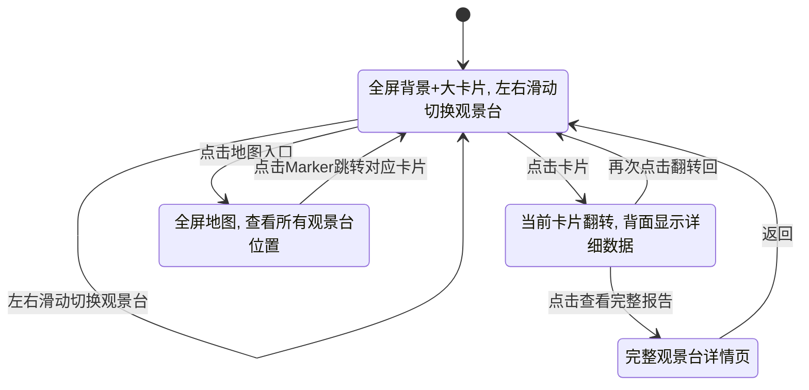
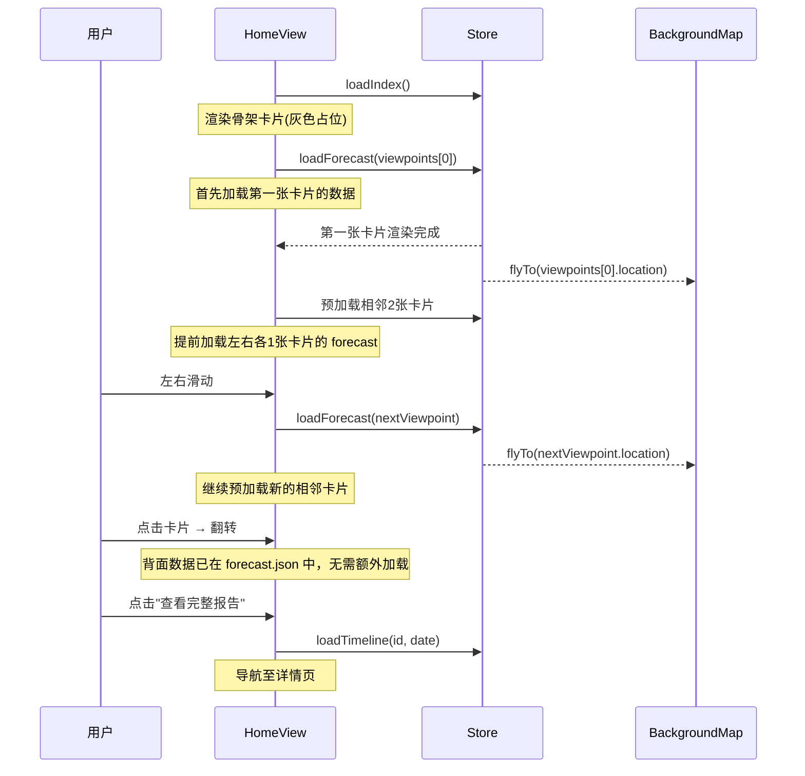

# 10-C. 卡片流方案 (Card Flow)

> **核心理念:** 沉浸式阅读体验。每个观景台是一张精心设计的大卡片，用户左右滑动浏览，卡片本身就是完美的社交分享图。
>
> 公共组件依赖 [10-frontend-common.md](./10-frontend-common.md)，总体需求见 [10-frontend.md](./10-frontend.md)。

---

## 10.C.1 方案概述

| 维度 | 说明 |
|------|------|
| **核心逻辑** | 沉浸式内容消费，大卡片一次展示一个观景台 |
| **典型参照** | 天气App / Instagram / 探探 |
| **信息密度** | 低密度——聚焦单个观景台的视觉冲击 |
| **适用用户** | 追求视觉体验、小红书运营截图、种草分享 |
| **截图优势** | 卡片本身就是完美排版的分享图，无需额外处理 |

---

## 10.C.2 页面结构

### 竖屏布局 (Mobile-First)

```
┌────────────────────────────┐
│ 📅 2月12日  ● ● ○ ○ ○  🗺️ │  ← 顶栏: 日期 + 分页指示器 + 地图入口
│                            │
│  ┏━━━━━━━━━━━━━━━━━━━━━━┓  │
│  ┃                      ┃  │
│  ┃    🏔️                ┃  │
│  ┃                      ┃  │  ← 背景: 高斯模糊地图
│  ┃  ┌──────────────┐    ┃  │     (随卡片切换平移)
│  ┃  │              │    ┃  │
│  ┃  │  牛 背 山     │    ┃  │  ← 前景: 大评分卡片
│  ┃  │              │    ┃  │     (可左右滑动切换)
│  ┃  │   ╭──────╮   │    ┃  │
│  ┃  │   │  98  │   │    ┃  │
│  ┃  │   │ 推荐  │   │    ┃  │
│  ┃  │   ╰──────╯   │    ┃  │
│  ┃  │              │    ┃  │
│  ┃  │ 🏔️90  ☁️88   │    ┃  │
│  ┃  │ ⭐45  ❄️--   │    ┃  │
│  ┃  │              │    ┃  │
│  ┃  │ 日出金山+云海 │    ┃  │
│  ┃  │ 组合日 🎯     │    ┃  │
│  ┃  │              │    ┃  │
│  ┃  └──────────────┘    ┃  │
│  ┃                      ┃  │
│  ┗━━━━━━━━━━━━━━━━━━━━━━┛  │
│                            │
│  ← 磐羊湖        折多山 → │  ← 左右滑动提示
└────────────────────────────┘
```

### 横屏布局 (Desktop)

```
┌────────────────────────────────────────────────────────┐
│ 📅 2月12日  ● ● ○ ○ ○ ○ ○ ○ ...        🔍  🗺️       │
├────────────────────────────────────────────────────────┤
│                                                        │
│   ┌──────────┐  ┌──────────────┐  ┌──────────┐        │
│   │ (上一站)  │  │              │  │ (下一站)  │        │
│   │  部分可见  │  │   当前卡片    │  │  部分可见  │        │
│   │ (缩小透明) │  │   牛背山      │  │ (缩小透明) │        │
│   │          │  │   98分 推荐   │  │          │        │
│   │          │  │              │  │          │        │
│   └──────────┘  └──────────────┘  └──────────┘        │
│                                                        │
│         ← 背景: 全屏高斯模糊地图 →                       │
│                                                        │
└────────────────────────────────────────────────────────┘
```

---

## 10.C.3 交互逻辑

### 流程图



### 核心手势

| 操作 | 行为 |
|------|------|
| **左右滑动** | 切换不同观景台的卡片 (Swiper)，背景地图平滑飞行过渡 |
| **上下滑动** | 同一观景台内切换不同日期 (卡片内部纵向滚动) |
| **点击卡片** | 卡片 3D 翻转 → 背面显示数据表格 (评分明细 + 七日趋势) |
| **再次点击/左右滑** | 翻转回正面 |
| **长按卡片** | 直接触发截图保存到相册 |
| **双指上滑** | 跳转至详情页 |

---

## 10.C.4 卡片设计

### 卡片正面

卡片是方案C的核心视觉元素——每张卡片本身就是一张精美的分享图。

```
┌──────────────────────────────┐
│                              │  ← 渐变背景 (评分对应色)
│         🏔️ 山脉插画           │  ← 顶部装饰插画
│                              │
│      ─── 牛 背 山 ───         │  ← 观景台名称 (大字居中)
│        海拔 3660m             │  ← 辅助信息
│                              │
│        ╭──────────╮          │
│        │          │          │  ← 超大评分环 ScoreRing(xl)
│        │    98    │          │
│        │   推 荐   │          │
│        ╰──────────╯          │
│                              │
│   🏔️ 日出金山 90   ☁️ 云海 88 │  ← 事件图标 + 分数
│   ⭐ 观星    45   ❄️ 雾凇 -- │
│                              │
│  ┌──────────────────────┐    │
│  │ 🌄☁️ 日出金山+壮观云海  │    │  ← summary 文字
│  │ 🎯 组合日  📸摄影师推荐│    │  ← 组合标签
│  └──────────────────────┘    │
│                              │
│   信心度 ████████░░ 高        │  ← 信心度进度条
│   07:15 - 07:45 最佳时段     │  ← 最佳时间窗口
│                              │
│          GMP 景观预测          │  ← 品牌水印
└──────────────────────────────┘
```

### 卡片背面 (翻转后)

```
┌──────────────────────────────┐
│  牛背山 · 2月12日 评分详情     │
├──────────────────────────────┤
│                              │
│  🏔️ 日出金山  90分 推荐       │
│  ┌──────────────────────┐   │
│  │ 光路通畅  ████████░ 35/35│   │
│  │ 目标可见  ███████░░ 35/40│   │
│  │ 本地晴朗  ██████░░░ 20/25│   │
│  └──────────────────────┘   │
│                              │
│  ☁️ 云海     88分 推荐       │
│  ┌──────────────────────┐   │
│  │ 高度差   ██████████ 50/50│   │
│  │ 密度    ██████░░░░ 20/30│   │
│  │ 风速    █████████░ 18/20│   │
│  └──────────────────────┘   │
│                              │
│  七日趋势                     │
│  ╱╲     ╱╲                   │
│ ╱  ╲   ╱  ╲                  │
│╱    ╲╱╱    ╲                  │
│ 12 13 14 15 16 17 18         │
│                              │
│  [查看完整报告 →]              │
└──────────────────────────────┘
```

### 卡片视觉变化

评分不同，卡片整体视觉风格随之变化：

| 状态 | 背景渐变 | 装饰元素 | 氛围 |
|------|----------|----------|------|
| **Perfect (95+)** | 金色→橙色渐变 | 光芒粒子动画 ✨ | 奢华金色 |
| **Recommended (80-94)** | 翠绿→青色渐变 | 轻盈云朵飘动 | 清新自然 |
| **Possible (50-79)** | 琥珀→浅黄渐变 | 薄雾效果 | 柔和温暖 |
| **Not Recommended (0-49)** | 灰色→浅灰渐变 | 雨滴/乌云 | 沉闷暗淡 |
| **无事件** | 中性灰渐变 | 无 | 安静平淡 |

---

## 10.C.5 背景地图

### 设计

地图作为**动态壁纸**存在，不可交互：

1. **渲染:** 在最底层渲染全屏高德地图
2. **遮罩:** 上覆一层 `backdrop-filter: blur(20px)` + 半透明暗色遮罩 (`rgba(0,0,0,0.3)`)
3. **标记:** 当前观景台坐标高亮一个发光圆点
4. **飞行:** 切换卡片时，底层地图使用 `flyTo` 平滑过渡到新坐标

### 地图参数

```javascript
const backgroundMap = new AMap.Map('bg-map', {
  zoom: 11,
  mapStyle: 'amap://styles/dark',   // ★ 暗色主题 (与方案A不同)
  viewMode: '2D',
  features: ['bg', 'road'],          // 仅基底+道路，无标注
  dragEnable: false,                  // ★ 禁止交互
  zoomEnable: false,
  touchZoom: false,
  keyboardEnable: false
})
```

### 全屏地图入口

右上角 🗺️ 按钮点击后：
1. 背景模糊层淡出 (300ms)
2. 卡片缩小并淡出 (300ms)
3. 地图变为可交互模式
4. 所有 Marker 出现 + 评分
5. 点击 Marker → 关闭地图 → 自动滑动到对应卡片

---

## 10.C.6 Swiper 容器

### 配置

```javascript
// 使用 Swiper.js 或 vue-awesome-swiper
const swiperOptions = {
  effect: 'cards',              // 堆叠卡片效果
  grabCursor: true,
  centeredSlides: true,
  slidesPerView: 1.15,          // 两侧微微露出相邻卡片
  spaceBetween: 16,
  pagination: {
    type: 'bullets',            // 顶部分页指示器
    dynamicBullets: true
  },
  on: {
    slideChange: (swiper) => {
      // 联动背景地图
      const viewpoint = viewpoints[swiper.activeIndex]
      backgroundMap.flyTo(viewpoint.location)
      store.selectViewpoint(viewpoint.id)
    }
  }
}
```

### 卡片过渡效果

| 过渡类型 | 效果 |
|----------|------|
| **左右滑** | 当前卡片向左推出同时缩小旋转，新卡片从右推入 |
| **背景飞行** | 底层地图 800ms 飞行动画配合 |
| **颜色渐变** | 顶栏和指示器颜色随卡片评分色渐变过渡 |

---

## 10.C.7 日期切换

### 卡片内纵向滚动

同一观景台的不同日期通过**纵向滑动**切换（与横向切换观景台正交）：

```
          ↑ 上滑: 明天 (2/13)
┌──────────────────────┐
│  牛背山 · 2月12日      │ ← 当前可见
│  98分 推荐            │
└──────────────────────┘
          ↓ 下滑: 昨天 (2/11，若有)
```

或者使用日期标签栏：

```
┌──────────────────────────────┐
│  12日  13日  14日  15日  ... │  ← 可横向滚动的日期标签
│  ───                        │
│  (当前选中: 12日)             │
└──────────────────────────────┘
```

> [!NOTE]
> **选择建议:** 使用日期标签栏而非纵向滑动，避免手势冲突（卡片翻转 + 纵向滑 + 横向滑 三种手势太复杂）。

---

## 10.C.8 截图场景

### "预测卡片"截图 (核心优势)

方案C的最大亮点——**卡片本身就是完美的分享图**。

**触发方式:**
1. 长按卡片 → "保存到相册" 弹窗
2. 顶栏 📸 按钮 → 直接截取当前卡片

**截图处理:**
- 保存为 1080×1920 (9:16 竖版，小红书最佳比例)
- 自动添加 GMP 品牌水印
- 自动添加日期角标
- 去除背景模糊地图，使用纯色渐变背景 (更适合传播)

### "对比组图"截图

一次截取多张卡片拼成组图：

```
┌──────────┬──────────┬──────────┐
│ 牛背山   │ 磐羊湖   │ 折多山    │
│  98分    │  90分    │  75分     │
│  推荐    │  推荐    │  可能     │
│ 金山+云海│  云海    │  金山     │
└──────────┴──────────┴──────────┘
        2月12日 川西观景预测
```

**触发:** 长按顶栏 📸 → "生成今日组图"

---

## 10.C.9 特有动画

| 动画 | 效果 | 时机 |
|------|------|------|
| **卡片入场** | 从底部弹起 + 旋转微晃 (spring) | 首次加载 |
| **滑动切换** | Cards effect 堆叠推送 | 左右滑动 |
| **背景飞行** | 底层地图 flyTo + 缩放 | 切换卡片时 800ms |
| **3D 翻转** | Y 轴 180° 翻转 (perspective) | 点击卡片正面 |
| **评分环填充** | 弧线从 0 渐进填满到目标分数 | 卡片进入视口 |
| **粒子效果** | 金色光点飘散 | Perfect 评分卡片 |
| **渐变脉冲** | 卡片边框发光呼吸 | Recommended 卡片 |
| **颜色渐变** | 顶栏颜色平滑过渡 | 卡片切换时 |
| **背景正反切换** | 模糊程度变化 | 卡片翻转时 |


### 关键 CSS 效果

```css
/* 卡片3D翻转 */
.card-container {
  perspective: 1000px;
}

.card {
  transform-style: preserve-3d;
  transition: transform var(--duration-slow) var(--ease-out-expo);
}

.card.flipped {
  transform: rotateY(180deg);
}

.card-front, .card-back {
  backface-visibility: hidden;
  position: absolute;
  width: 100%;
  height: 100%;
}

.card-back {
  transform: rotateY(180deg);
}

/* Perfect 评分粒子光效 */
.card--perfect::after {
  content: '';
  position: absolute;
  inset: 0;
  background: radial-gradient(circle at 50% 30%, rgba(255, 215, 0, 0.3), transparent 60%);
  animation: sparkle 3s ease-in-out infinite;
}

@keyframes sparkle {
  0%, 100% { opacity: 0.4; }
  50% { opacity: 1; }
}
```

---

## 10.C.10 组件树 (方案特有)

```
App.vue
└── HomeView.vue (方案C首页)
    ├── CardTopBar.vue            # 日期标签 + 分页指示器 + 地图入口
    ├── BackgroundMap.vue         # ★ 暗色模糊地图背景 ★
    ├── CardSwiper.vue            # ★ 方案C核心: Swiper容器 ★
    │   └── PredictionCard.vue × N   # ★ 大卡片 (可翻转) ★
    │       ├── CardFront.vue        # 正面: 评分 + 概览
    │       │   ├── ScoreRing.vue    [公共, xl尺寸]
    │       │   ├── EventIcon.vue    [公共]
    │       │   └── StatusBadge.vue  [公共]
    │       └── CardBack.vue         # 背面: 数据表格
    │           ├── BreakdownTable.vue [公共]
    │           └── WeekTrend.vue     [公共]
    ├── FullscreenMap.vue         # 地图全屏模式 (从🗺️入口打开)
    │   ├── AMapContainer.vue     [公共]
    │   └── ViewpointMarker.vue × N [公共]
    └── ScreenshotBtn.vue         [公共]
```

### 方案 C 专有组件

| 组件 | 用途 |
|------|------|
| `CardSwiper.vue` | Swiper 容器，管理卡片切换和手势 |
| `PredictionCard.vue` | 核心可翻转预测卡片 |
| `CardFront.vue` | 卡片正面 (视觉冲击力) |
| `CardBack.vue` | 卡片背面 (数据详情) |
| `BackgroundMap.vue` | 暗色模糊地图壁纸 |
| `FullscreenMap.vue` | 全屏地图模态 (从🗺️入口) |
| `CardTopBar.vue` | 日期标签 + 分页指示器 |

---

## 10.C.11 数据加载时序 (方案特有)



> [!TIP]
> **渐进加载策略:** 首次只加载第一张 + 相邻 2 张卡片的 `forecast.json`。用户滑动时预加载下一张的数据，保持流畅体验。背景地图仅在飞行时加载瓦片图，不预加载全区域。

---

## 10.C.12 额外依赖

方案C相比A/B需要额外引入：

| 依赖 | 用途 |
|------|------|
| `swiper` | 卡片滑动容器 (Vue3 版) |
| `@lottiefiles/lottie-player` (可选) | Perfect 评分的精美粒子动画 |

