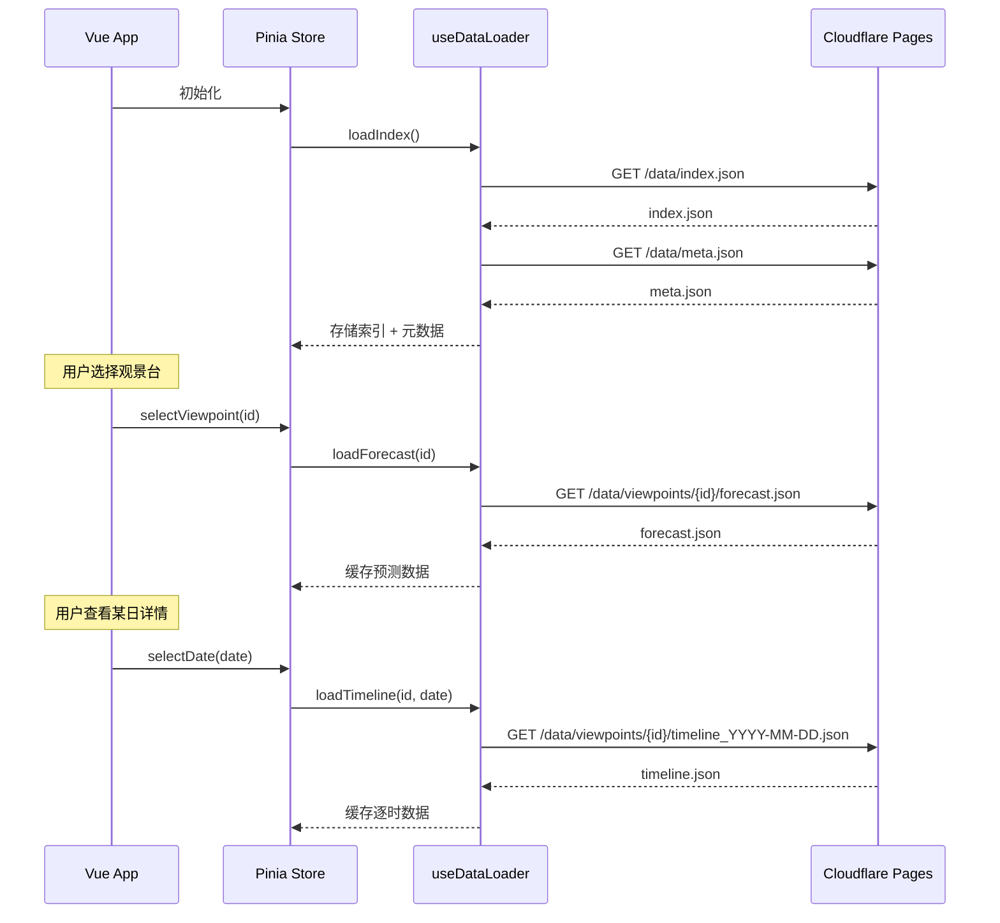

# 10-0. 前端公共组件设计

> **本文档定义三套前端方案 (A/B/C) 共享的技术基础、组件库和数据层。**
> 各方案只需关注自身的布局和交互逻辑，无需重复定义公共部分。
>
> 总体设计需求见 [10-frontend.md](./10-frontend.md)。

---

## 10.0.1 技术栈与项目结构

### 技术选型

| 技术 | 选择 | 理由 |
|------|------|------|
| **框架** | Vite + Vue 3 (Composition API) | 组件化开发、动画支持好、CF Pages 原生支持 |
| **地图** | 高德地图 JS API v2.0 | 中文标注友好，国内用户体验好 |
| **CSS** | UnoCSS (Attributify Mode) | 原子化 CSS，按需生成，打包体积小 |
| **动画** | GSAP (ScrollTrigger) | 专业级动画库，性能优异 |
| **图表** | ECharts (按需引入) | 趋势图、热力图，中文生态成熟 |
| **托管** | Cloudflare Pages | `npm run build` 生成静态文件直接部署 |
| **数据** | 静态 JSON (按需加载) | 由 `generate-all` 命令一次性生成 |

### 目录结构

```
src/
├── main.js                    # 入口
├── App.vue                    # 根组件 (方案特定的布局在此挂载)
├── router/index.js            # 路由定义
├── stores/                    # Pinia 状态管理
│   ├── viewpoints.js          # 观景台数据 store
│   ├── routes.js              # 线路数据 store
│   └── app.js                 # 全局 UI 状态 (当前选中、日期等)
├── composables/               # 组合式函数
│   ├── useDataLoader.js       # JSON 数据加载 (含缓存)
│   ├── useScoreColor.js       # 评分→颜色映射
│   ├── useComboTags.js        # 组合推荐标签计算
│   ├── useAMap.js             # 高德地图封装
│   └── useScreenshot.js       # 截图导出
├── components/                # 公共组件
│   ├── score/                 # 评分可视化
│   │   ├── ScoreRing.vue      # 环形评分
│   │   ├── ScoreBar.vue       # 条形评分
│   │   └── StatusBadge.vue    # 状态标签
│   ├── event/                 # 事件展示
│   │   ├── EventIcon.vue      # 景观图标
│   │   ├── EventCard.vue      # 事件详情卡片
│   │   └── EventList.vue      # 事件列表
│   ├── forecast/              # 预测展示
│   │   ├── DaySummary.vue     # 单日摘要
│   │   ├── WeekTrend.vue      # 七日趋势图
│   │   ├── HourlyTimeline.vue # 逐时时间线
│   │   └── BreakdownTable.vue # 评分明细表
│   ├── map/                   # 地图组件
│   │   ├── AMapContainer.vue  # 地图容器
│   │   ├── ViewpointMarker.vue# 观景台标记
│   │   └── RouteLine.vue      # 线路连线
│   ├── layout/                # 布局通用
│   │   ├── DatePicker.vue     # 日期选择器
│   │   ├── FilterBar.vue      # 筛选栏
│   │   └── UpdateBanner.vue   # 数据更新时间提示
│   └── export/                # 导出相关
│       ├── ScreenshotBtn.vue  # 截图按钮
│       └── ShareCard.vue      # 分享卡片 (合成图)
└── assets/
    ├── icons/                 # SVG 图标集
    ├── styles/                # 全局样式
    │   ├── variables.css      # CSS 变量 (配色方案)
    │   ├── typography.css     # 字体系统
    │   └── animations.css     # 公共动画定义
    └── illustrations/         # 景观小插画
```

---

## 10.0.2 数据加载策略

### 加载流程



### useDataLoader 接口

```javascript
// composables/useDataLoader.js
export function useDataLoader() {
  const cache = new Map()

  async function loadIndex() { /* GET /data/index.json + /data/meta.json */ }
  async function loadForecast(viewpointId) { /* GET /data/viewpoints/{id}/forecast.json */ }
  async function loadTimeline(viewpointId, date) { /* GET /data/viewpoints/{id}/timeline_YYYY-MM-DD.json */ }
  async function loadRouteForecast(routeId) { /* GET /data/routes/{id}/forecast.json */ }

  return { loadIndex, loadForecast, loadTimeline, loadRouteForecast }
}
```

### 数据 Store (Pinia)

```javascript
// stores/viewpoints.js
export const useViewpointStore = defineStore('viewpoints', () => {
  const index = ref([])          // index.json → viewpoints 数组
  const meta = ref(null)         // meta.json
  const forecasts = ref({})      // { viewpointId: forecast.json }
  const timelines = ref({})      // { "viewpointId:date": timeline.json }
  const selectedId = ref(null)
  const selectedDate = ref(null) // 默认 = 今天

  // Getters
  const currentViewpoint = computed(...)
  const currentForecast = computed(...)
  const currentDayEvents = computed(...)

  return { index, meta, forecasts, timelines, selectedId, selectedDate, ... }
})
```

---

## 10.0.3 核心公共组件

### ScoreRing — 环形评分

统一的评分可视化组件，三个方案均使用。

| Prop | Type | Default | 说明 |
|------|------|---------|------|
| `score` | Number | 0 | 0-100 评分 |
| `size` | String | `'md'` | `'sm'` / `'md'` / `'lg'` / `'xl'` |
| `showLabel` | Boolean | true | 是否显示中心数字 |
| `animated` | Boolean | true | 是否动画过渡 |

**尺寸规格:**

| Size | 直径 | 用途 |
|------|------|------|
| `sm` | 32px | 列表项内嵌 |
| `md` | 48px | 卡片内标题旁 |
| `lg` | 72px | 详情页标题 |
| `xl` | 120px | 卡片流方案的主评分 |

**颜色映射 (useScoreColor):**

| 范围 | 颜色 | CSS 变量 | 状态 |
|------|------|----------|------|
| 95-100 | 金色渐变 | `--score-perfect` | Perfect |
| 80-94 | 翠绿 | `--score-recommended` | Recommended |
| 50-79 | 琥珀 | `--score-possible` | Possible |
| 0-49 | 灰色 | `--score-not-recommended` | Not Recommended |

### EventIcon — 景观图标

每种景观类型对应一组 SVG 图标 + 颜色。

| event_type | 图标 | 主色 | 描述 |
|------------|------|------|------|
| `sunrise_golden_mountain` | 🏔️ + 日出光芒 | `#FF8C00` | 橙金色 |
| `sunset_golden_mountain` | 🏔️ + 夕阳光芒 | `#FF4500` | 橙红色 |
| `cloud_sea` | ☁️ 叠云 | `#87CEEB` | 天蓝色 |
| `stargazing` | ⭐ 星空 | `#4A0E8F` | 深紫色 |
| `frost` | ❄️ 冰花 | `#B0E0E6` | 浅蓝色 |
| `snow_tree` | 🌲 + 雪 | `#E0E8EF` | 银白色 |
| `ice_icicle` | 💎 冰柱 | `#ADD8E6` | 冰蓝色 |

### StatusBadge — 状态标签

轻量标签组件，展示 `Perfect` / `Recommended` / `Possible` / `Not Recommended`。

- 带对应颜色背景 + 圆角 pill 形状
- 支持中/英双语显示

### DaySummary — 单日摘要

展示一天的预测概览，可在列表、卡片、Bottom Sheet 中复用。

**结构:**

```
┌──────────────────────────────┐
│  2月12日 周三                │
│  🌄☁️ 日照金山+壮观云海       │
│  ┌──────┐ ┌──────┐          │
│  │ 🏔️90 │ │ ☁️90 │ │ ⭐45 │ │
│  │ 推荐  │ │ 推荐  │ │ 一般 │ │
│  └──────┘ └──────┘          │
└──────────────────────────────┘
```

### WeekTrend — 七日趋势图

使用 ECharts 展示 7 天评分趋势，支持多事件类型对比。

**图表类型:** 折线图 (Area)  
**X 轴:** 日期  
**Y 轴:** 0-100 评分  
**系列:** 每个事件类型一条线 (颜色对应 EventIcon 主色)  
**交互:** 点击某日 → 更新 selectedDate → 联动详情

### HourlyTimeline — 逐时时间线

展示某一天 24 小时的逐时数据，标注事件激活区间。

**形式:** 水平时间轴 + 彩色事件区间条  
**数据源:** `timeline_YYYY-MM-DD.json`

### BreakdownTable — 评分明细表

展示某个事件的评分维度拆解。

```
┌─────────────────────┬──────┬──────┐
│ 维度                 │ 得分  │ 满分  │
├─────────────────────┼──────┼──────┤
│ 光路通畅             │ 35   │ 35   │
│ 目标可见             │ 35   │ 40   │
│ 本地晴朗             │ 20   │ 25   │
├─────────────────────┼──────┼──────┤
│ 总分                 │ 90   │ 100  │
└─────────────────────┴──────┴──────┘
```

---

## 10.0.4 组合推荐标签 (前端计算)

根据 `05-api.md` 的设计，组合推荐标签由前端自行计算：

```javascript
// composables/useComboTags.js

export function useComboTags() {
  function computeTags(dayEvents) {
    const tags = []
    const recommended = dayEvents.filter(e => e.score >= 80)

    // combo_day: 同日 2+ 个 Recommended 以上事件
    if (recommended.length >= 2) {
      tags.push({ type: 'combo_day', label: '组合日', icon: '🎯' })
    }

    // photographer_pick: 金山+云海同日
    const hasGoldenMountain = recommended.some(e =>
      e.event_type.includes('golden_mountain')
    )
    const hasCloudSea = recommended.some(e =>
      e.event_type === 'cloud_sea'
    )
    if (hasGoldenMountain && hasCloudSea) {
      tags.push({ type: 'photographer_pick', label: '摄影师推荐', icon: '📸' })
    }

    // perfect_day: 有任一事件 95+
    if (dayEvents.some(e => e.score >= 95)) {
      tags.push({ type: 'perfect_day', label: '完美之日', icon: '✨' })
    }

    return tags
  }

  return { computeTags }
}
```

---

## 10.0.5 地图公共层

### AMapContainer

封装高德地图初始化、缩放限制、样式主题。

```javascript
// composables/useAMap.js

export function useAMap(containerId) {
  let map = null

  function init(options = {}) {
    map = new AMap.Map(containerId, {
      zoom: 8,
      center: [102.0, 30.5],           // 川西中心
      mapStyle: 'amap://styles/light',  // 浅色主题
      zooms: [6, 15],                   // 缩放范围
      ...options
    })
  }

  function flyTo(lon, lat, zoom = 12) {
    map.setZoomAndCenter(zoom, [lon, lat], true, 800) // 800ms 动画
  }

  function addMarker(viewpoint, score) { /* ScoreMarker 工厂 */ }
  function addRouteLine(stops) { /* Polyline 连线 */ }
  function fitBounds(viewpoints) { /* 自适应视野 */ }

  return { init, flyTo, addMarker, addRouteLine, fitBounds, map }
}
```

### ViewpointMarker — 评分标记

地图上的自定义标记点，颜色反映评分。

**标记样式:**
- 圆形底座 + 评分数字
- 颜色使用 `useScoreColor` 统一映射
- 选中状态: 放大 + 弹跳动画 + 信息窗体

### RouteLine — 线路连线

将线路各站连线展示。

- 虚线样式 + 箭头方向
- 站点按 order 排序
- 悬浮时高亮

---

## 10.0.6 截图导出

### 实现策略

使用 `html2canvas` 配合 DOM 区域截图。

```javascript
// composables/useScreenshot.js

export function useScreenshot() {
  async function capture(element, filename = 'gmp-prediction.png') {
    const canvas = await html2canvas(element, {
      scale: 2,               // 2x 分辨率
      backgroundColor: null,  // 透明背景 (方案C需要)
      useCORS: true
    })
    // 下载
    const link = document.createElement('a')
    link.download = filename
    link.href = canvas.toDataURL('image/png')
    link.click()
  }

  return { capture }
}
```

### 截图区域标记

各组件通过 `ref="screenshotArea"` 标记可截图区域，配合 `ScreenshotBtn.vue` 触发导出。

---

## 10.0.7 配色方案

### CSS 变量

```css
/* assets/styles/variables.css */

:root {
  /* 基础色调 */
  --color-primary: #3B82F6;       /* 高山蓝 */
  --color-primary-light: #93C5FD;
  --color-accent: #F59E0B;        /* 日出金 */
  --color-accent-warm: #EF4444;   /* 晚霞红 */

  /* 评分色阶 */
  --score-perfect: linear-gradient(135deg, #FFD700, #FF8C00);
  --score-recommended: #10B981;
  --score-possible: #F59E0B;
  --score-not-recommended: #9CA3AF;

  /* 背景 */
  --bg-primary: #F8FAFC;
  --bg-card: #FFFFFF;
  --bg-overlay: rgba(255, 255, 255, 0.85);

  /* 文字 */
  --text-primary: #1E293B;
  --text-secondary: #64748B;
  --text-muted: #94A3B8;

  /* 圆角 */
  --radius-sm: 8px;
  --radius-md: 12px;
  --radius-lg: 20px;
  --radius-full: 9999px;

  /* 阴影 */
  --shadow-card: 0 2px 8px rgba(0, 0, 0, 0.06);
  --shadow-elevated: 0 8px 24px rgba(0, 0, 0, 0.1);
  --shadow-float: 0 16px 48px rgba(0, 0, 0, 0.12);

  /* 动画 */
  --ease-out-expo: cubic-bezier(0.16, 1, 0.3, 1);
  --duration-fast: 200ms;
  --duration-normal: 350ms;
  --duration-slow: 600ms;
}
```

### 字体系统

```css
/* assets/styles/typography.css */

@import url('https://fonts.googleapis.com/css2?family=Inter:wght@400;500;600;700&display=swap');

:root {
  --font-sans: 'Inter', -apple-system, 'PingFang SC', 'Noto Sans SC', sans-serif;
  --font-mono: 'JetBrains Mono', 'Fira Code', monospace;

  --text-xs: 0.75rem;    /* 12px — 标签 */
  --text-sm: 0.875rem;   /* 14px — 辅助说明 */
  --text-base: 1rem;     /* 16px — 正文 */
  --text-lg: 1.125rem;   /* 18px — 小标题 */
  --text-xl: 1.5rem;     /* 24px — 标题 */
  --text-2xl: 2rem;      /* 32px — 大标题 */
  --text-4xl: 3rem;      /* 48px — 评分数字 */
}
```

---

## 10.0.8 路由设计

三个方案共享相同的路由结构，仅根组件不同：

| 路由 | 组件 | 说明 |
|------|------|------|
| `/` | `HomeView.vue` | 首页 (方案特定: 地图/列表/卡片) |
| `/viewpoint/:id` | `ViewpointDetail.vue` | 观景台详情页 |
| `/viewpoint/:id/:date` | `ViewpointDetail.vue` | 某天详情 |
| `/route/:id` | `RouteDetail.vue` | 线路详情页 |

> [!NOTE]
> **详情页共享**: `ViewpointDetail.vue` 和 `RouteDetail.vue` 是三方案共用的详情页面，内部使用公共组件 (`WeekTrend`、`HourlyTimeline`、`BreakdownTable`) 组装。各方案的差异仅体现在**首页布局**和**导航至详情的过渡动画**上。

---

## 10.0.9 SEO 与分享

### Meta 标签

```html
<!-- index.html -->
<meta name="description" content="川西景观预测 — 日照金山、云海、观星、雾凇 最佳时机一键查看">
<meta property="og:title" content="川西景观预测引擎 GMP">
<meta property="og:description" content="让每一次川西之行，都不错过自然的馈赠">
```

### 分享卡片

`ShareCard.vue` 将当前预测信息合成为适合社交分享的图片：
- 固定 1080×1440 尺寸 (小红书竖版)
- 含品牌 Logo
- 自动优化排版密度

---

## 10.0.10 方案特定职责 (不在公共层)

以下内容由各方案 (A/B/C) 的独立设计文档定义，**不在公共层**:

| 职责 | 说明 |
|------|------|
| **首页布局** | 地图/列表/卡片流的组织方式 |
| **导航交互** | Bottom Sheet / 手风琴 / 滑动卡片 |
| **过渡动画** | 页面切换的转场效果 |
| **特殊手势** | 各方案独特的手势交互 |

