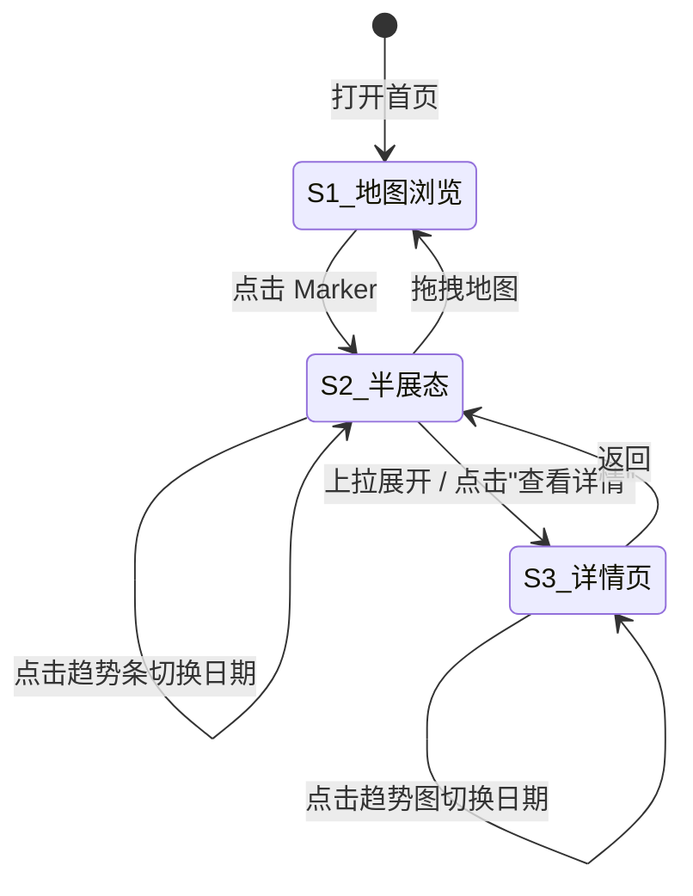

# 11. 前端信息架构重构 — 设计文档

> **目标**：重构 GMP 前端的信息展示架构，解决三个核心痛点：1) 未配置事件不展示；2) 缺少逐时评分；3) 无法直观看到多日趋势。

## 11.1 问题诊断

当前前端**只围绕"事件评分"展示信息**，但用户真正需要的是**"天气概况 + 事件评分"的综合视图**。

| 痛点 | 现象 | 根因 |
|------|------|------|
| **未配置事件不展示** | 红石滩只配了 `sunset`，看不到雾凇/雪挂树预测 | 后端 capabilities 不完整，缺乏通用能力自动注入 |
| **缺少逐时评分** | 白天晴天但全天评分为 0（因晚上乌云） | 全天聚合打分，无时段维度；`timeline.json` weather 为空 |
| **无法看趋势** | 进入景点详情后需反复切换日期 | 七日趋势埋在页面底部，不够突出 |

## 11.2 评分体系重构

### 11.2.1 能力分层

将 capabilities 分为三个层级，**基底层和通用层自动注入所有观景台**：

| 层级 | capabilities | 含义 | 配置方式 |
|------|-------------|------|---------|
| **基底层** | `clear_sky`（晴天）, `stargazing`（观星） | "天气好，值得去" | 所有观景台自动拥有 |
| **通用层** | `frost`（雾凇）, `snow_tree`（雪挂树）, `ice_icicle`（冰挂） | "有特殊冰雪景观" | 所有川西高海拔自动拥有 |
| **地形层** | `sunrise`（日出金山）, `sunset`（日落金山）, `cloud_sea`（云海） | "强烈建议去" | 需手动配置（取决于朝向/海拔/target） |

> 实现细节见 [MG2-universal-capabilities.md](file:///Users/mpb/WorkSpace/golden-moment-predictor/implementation_plan/MG2-universal-capabilities.md)

### 11.2.2 综合评分逻辑

- **地图 Marker 显示**：所有事件中的**最高分** + 最高分事件的**图标徽章**
- 同分时优先级：地形层 > 通用层 > 基底层（优先展示更稀有的景观）
- 多个高分事件可叠加图标：`🏔️☁️ 92`

### 11.2.3 图标体系

5 组图标，部分事件共用同一图标以降低认知成本：

| 组名 | 对应事件 | 设计方向 |
|------|---------|---------|
| **晴天** | `clear_sky` | 太阳：圆形 + 放射光芒线 |
| **金山** | `sunrise_golden_mountain`, `sunset_golden_mountain` | 山峰轮廓 + 光晕（**两者共用**） |
| **云海** | `cloud_sea` | 山峰露出云层之上（≠阴天） |
| **观星** | `stargazing` | 月牙 + 星星组合 |
| **冰晶** | `frost`, `snow_tree`, `ice_icicle` | 六角冰晶（≠飘落雪花）（**三者共用**） |

> 实现细节见 [MG1-svg-icon-design.md](file:///Users/mpb/WorkSpace/golden-moment-predictor/implementation_plan/MG1-svg-icon-design.md)

## 11.3 地图 Marker 设计

### 当前

```
┌────────────────────┐
│  理小路红石滩（凉台沟） │
│         0          │
└────────────────────┘
```

只有一个数字，无法区分"什么类型的 0 分"。

### 改进后

```
┌──────────┐     ┌──────────┐     ┌──────────┐
│  红石滩   │     │  牛背山   │     │  折多山   │
│  ☀️ 75   │     │ 🏔️☁️ 92 │     │  ⛅ 30   │
└──────────┘     └──────────┘     └──────────┘
 仅晴天好         金山+云海双buff    天气一般
```

用户一眼区分：同样高分时，有🏔️的地形景观优先于仅☀️的晴天。

## 11.4 BottomSheet 半展态设计

点击 Marker 后弹出半屏，一次提供三层信息：

```
┌─────────────────────────────────────┐
│  红石滩（凉台沟）           ☀️ 75    │ ← ① 标题 + 最高分
│  ❌🏔️ 山顶99%云                     │ ← ② 0分事件精简原因
│  ─ ─ ─ ─ ─ ─ ─ ─ ─ ─ ─ ─ ─ ─ ─  │
│  🌄5-8    ☀️8-16   🌅16-19   ⭐19-5 │ ← ③ 四段时段评分
│  ☀️晴62   ☀️晴75   🏔️金山0   ⭐观星60│
│  ─ ─ ─ ─ ─ ─ ─ ─ ─ ─ ─ ─ ─ ─ ─  │
│  19  20  21  22  23  24  25        │ ← ④ 七日迷你趋势
│   0  39  50  90  55  30   5        │    数字颜色=分数高低
│  ☀️  ☀️  🏔️  🏔️  ☀️  ⛅   ⛅       │    最佳事件图标
└─────────────────────────────────────┘
```

### 11.4.1 信息层级

| 层 | 内容 | 解决的痛点 |
|----|------|-----------|
| ① 标题行 | 景点名 + 最高分 + 最佳事件图标 | — |
| ② 原因行 | **仅 0 分事件**的精简原因：`❌🏔️ 山顶99%云` | 痛点 1（未配事件不透明） |
| ③ 时段行 | 四段摄影时段的最佳事件 + 评分 | 痛点 2（缺逐时信息） |
| ④ 趋势行 | 七天分数 + 最佳事件图标 | 痛点 3（无趋势） |

### 11.4.2 四段时段划分（摄影友好）

| 时段 | 时间 | 典型事件 |
|------|------|---------|
| 🌄 日出 | 05:00 - 08:00 | 日出金山、晴天 |
| ☀️ 白天 | 08:00 - 16:00 | 晴天、雾凇、雪挂树 |
| 🌅 日落 | 16:00 - 19:00 | 日落金山、晴天 |
| ⭐ 夜晚 | 19:00 - 05:00 | 观星 |

### 11.4.3 交互

- **点击趋势条某天** → 上方时段摘要切换到那天的数据
- **上拉全展态** → 进入详情内容或跳转详情页

## 11.5 详情页设计（趋势优先）

**取消独立的日期选择器**，用七日趋势图本身来选日期：

```
┌─────────────────────────────────────┐
│  ← 返回    红石滩（凉台沟）     📷   │
├─────────────────────────────────────┤
│                                     │
│  90 ┤          ██                   │ ← ① 七日趋势图
│  60 ┤      ░░  ██  ░░              │    柱状/折线图
│  30 ┤  ░░  ░░  ██  ░░  ░░         │    点击柱体=选日期
│   0 ┤──░░──────────────░░──░░──    │
│      19  20  21  22  23  24  25    │
│      ☀️  ☀️  🏔️  🏔️  ☀️  ⛅  ⛅   │
│               ▲ 选中                │
├─────────────────────────────────────┤
│  2/22 周日   🏔️ 90 分   强烈推荐    │ ← ② 选中日摘要
│  ❌⭐ 月相不佳                       │    0分事件原因
├─────────────────────────────────────┤
│  🌄 日出  🏔️金山 85  ☀️晴 70       │ ← ③ 四段时段评分
│  ☀️ 白天  ☀️晴 80    ❄️雾凇 60      │    每段显示活跃事件
│  🌅 日落  🏔️金山 90                │
│  ⭐ 夜晚  -- 月相不佳               │
├─────────────────────────────────────┤
│  事件维度详情                        │ ← ④ breakdown
│  🏔️ 日落金山  90/100                │    展开看每个子维度
│    光路 30/35 | 目标 35/40 | 本地 25/25│
│  ☀️ 晴天     80/100                 │
│    云量 40/50 | 降水 20/25 | 能见 20/25│
├─────────────────────────────────────┤
│  逐时天气（可折叠）                   │ ← ⑤ 精简逐时天气
│  06:00  ☀️  -3°C  云10%             │    四列：时间|图标|温度|云量
│  07:00  ☀️  -1°C  云15%             │
│  ...                                │
├─────────────────────────────────────┤
│       📸 截图分享    🔗 分享          │
└─────────────────────────────────────┘
```

### 11.5.1 布局层级

| 区域 | 内容 | 说明 |
|------|------|------|
| ① 趋势图 | 七日柱状/折线 + 事件图标 | **替代**原来的日期选择器，点击选日期 |
| ② 日摘要 | 日期 + 最高分 + 状态 + 0分原因 | 跟随趋势图选中日变化 |
| ③ 时段评分 | 四段摄影时段各自的事件 + 评分 | 回答"什么时候值得去" |
| ④ 维度详情 | 每个事件的 breakdown 进度条 | 回答"为什么得这个分" |
| ⑤ 逐时天气 | 可折叠的 24h 天气表 | 精简版：时间 + 天气图标 + 温度 + 云量 |

### 11.5.2 交互

- 趋势图**点击柱体** → ②③④⑤ 全部切换到对应日期
- ④ 事件维度默认折叠，点击展开
- ⑤ 逐时天气默认折叠，点击展开

## 11.6 后端数据需求

### 11.6.1 forecast.json 变更

```diff
 {
   "daily": [{
     "date": "2026-02-22",
     "summary": "强烈推荐 — 日落金山+晴天",
     "best_event": { "event_type": "sunset_golden_mountain", "score": 90 },
     "events": [
+      { "event_type": "clear_sky", "display_name": "晴天", "score": 80, ... },
       { "event_type": "sunset_golden_mountain", "score": 90, ... },
+      { "event_type": "stargazing", "score": 0,
+        "reject_reason": "月相不佳",  // ← 新增：0分事件的精简原因
+        ...
+      },
+      { "event_type": "frost", "score": 60, ... },
       ...
     ]
   }]
 }
```

| 字段 | 变更 |
|------|------|
| `events[]` | 新增 `clear_sky` 等通用事件（由 MG2 自动注入） |
| `events[].reject_reason` | **[NEW]** 0 分事件的一句话精简原因 |

### 11.6.2 timeline.json 变更

```diff
 {
   "hourly": [{
     "hour": 7,
     "time": "07:00",
     "safety_passed": true,
-    "weather": {},
+    "weather": {
+      "temperature": -3.2,
+      "cloud_cover": 10,
+      "weather_icon": "clear"
+    },
     "events_active": [
+      { "event_type": "clear_sky", "status": "Active", "score": 80 }
     ],
     "tags": ["clear_sky"]
   }]
 }
```

| 字段 | 变更 |
|------|------|
| `weather.temperature` | **[NEW]** 气温 (°C) |
| `weather.cloud_cover` | **[NEW]** 总云量 (%) |
| `weather.weather_icon` | **[NEW]** 天气图标标识（`clear`/`partly_cloudy`/`cloudy`/`rain`/`snow`） |

### 11.6.3 index.json 变更

```diff
 {
   "viewpoints": [{
     "id": "transit_lixiao_redstone",
-    "capabilities": ["sunset"],
+    "capabilities": ["sunset", "clear_sky", "stargazing", "frost", "snow_tree", "ice_icicle"],
   }]
 }
```

## 11.7 状态流转



## 11.8 实施路径

| 优先级 | 任务 | 计划编号 | 依赖 |
|--------|------|---------|------|
| **P0** | 新增 ClearSkyPlugin + 通用能力自动注入 | MG2 | 无 |
| **P0** | SVG 图标设计 | MG1 | 无 |
| P1 | 补充 timeline.json weather 数据 | 待新建 | 无 |
| P1 | 补充 forecast.json reject_reason 字段 | 待新建 | MG2 |
| P2 | 前端 Marker 改造（分数+图标徽章） | 待新建 | MG1, MG2 |
| P2 | 前端 BottomSheet 半展态重构 | 待新建 | P1 |
| P3 | 前端详情页重构（趋势优先） | 待新建 | P1, P2 |

> **MG1 和 MG2 已生成行动计划**，可在新会话中独立执行。
> P1~P3 的详细行动计划待本文档确认后再逐步生成。

## 11.9 待继续探索

- [ ] 时段评分的后端计算方式（前端计算 vs 后端预聚合）
- [ ] `reject_reason` 的生成逻辑（前端从 breakdown 推断 vs 后端直接输出）
- [ ] 逐时天气图标(weather_icon)的映射规则
- [ ] 趋势图的可视化组件选型（Canvas vs SVG vs CSS）
- [ ] 截图功能对新布局的适配

---

*文档版本: v1.0 | 创建: 2026-02-19 | 状态: 头脑风暴完成，待确认*
*前序文档: [10-frontend.md](file:///Users/mpb/WorkSpace/golden-moment-predictor/design/10-frontend.md)*
