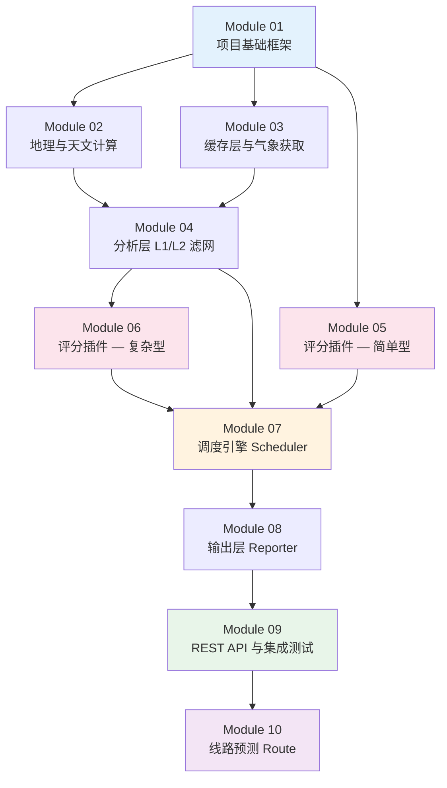

# GMP 实施计划书 — 总览

> **目标**: 将系统设计文档 (`design/`) 拆分为可独立执行的开发模块，每个模块可在一个新会话中完成开发、测试。

## 模块依赖图

## 模块列表

| 模块 | 文件 | 内容简述 | 依赖模块 | 预估工作量 |
|------|------|---------|---------|-----------|
| **01** | [module-01-foundation.md](./module-01-foundation.md) | 项目骨架、数据模型、异常类、配置加载 | 无 | 小 |
| **02** | [module-02-astro-geo.md](./module-02-astro-geo.md) | 天文计算 + 地理工具 | M01 | 中 |
| **03** | [module-03-cache-fetcher.md](./module-03-cache-fetcher.md) | SQLite 缓存 + Open-Meteo 数据获取 | M01 | 中 |
| **04** | [module-04-analyzer.md](./module-04-analyzer.md) | L1 本地滤网 + L2 远程滤网 | M01, M02, M03 | 中 |
| **05** | [module-05-scorer-simple.md](./module-05-scorer-simple.md) | 4 个简单评分插件 (云海/雾凇/树挂/冰挂) + ScoreEngine | M01 | 中 |
| **06** | [module-06-scorer-complex.md](./module-06-scorer-complex.md) | 2 个复杂评分插件 (日照金山/观星) | M01, M04 | 中 |
| **07** | [module-07-scheduler.md](./module-07-scheduler.md) | 主调度器 GMPScheduler | M01-M06 | 大 |
| **08** | [module-08-reporter.md](./module-08-reporter.md) | ForecastReporter + TimelineReporter + CLI | M01, M07 | 中 |
| **09** | [module-09-api-integration.md](./module-09-api-integration.md) | FastAPI 路由 + 集成测试 + E2E 测试 | M01-M08 | 大 |

## 执行顺序建议

1. **Phase 1 (基础)**: Module 01 → Module 02 + Module 03 (可并行)
2. **Phase 2 (核心)**: Module 04 → Module 05 + Module 06 (可并行) 
3. **Phase 3 (集成)**: Module 07 → Module 08 → Module 09
4. **Phase 4 (扩展)**: Module 10

## 每个模块文件说明

每个模块计划书包含以下标准结构：

1. **模块背景**: 在系统中的定位
2. **设计依据**: 引用的设计文档章节
3. **待创建文件列表**: 精确的文件路径和内容说明
4. **代码接口定义**: 完整的接口和数据结构
5. **实现要点**: 关键逻辑和算法
6. **测试计划**: 具体测试用例和预期结果
7. **验收标准**: 明确的完成条件

> **重要**: 每个模块都包含了足够的上下文信息，可以独立交给一个新会话完成开发，无需额外背景知识。
