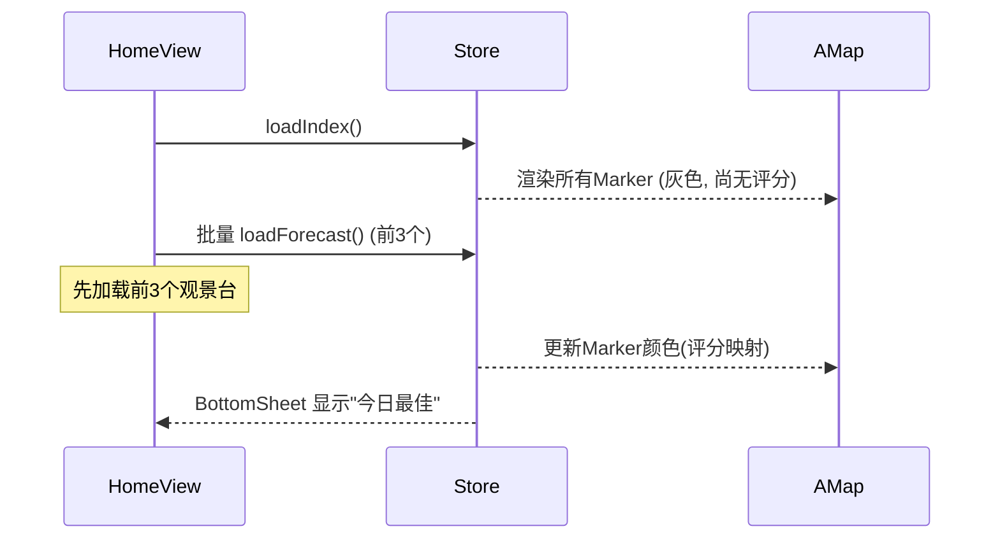

# MA4: A 方案 — 动画交互与首屏优化

> **For Claude:** REQUIRED SUB-SKILL: Use executing-plans to implement this plan task-by-task.

**Goal:** 实现 A 方案特有的动画效果 (Marker 入场、脉冲光圈、评分数字滚动) 和首屏数据加载优化。

**依赖模块:** MA1 (首页布局), MA2 (BottomSheet), M22 (Marker), GSAP

---

## 背景

A 方案需要丰富的动画来增强沉浸感。本模块聚焦设计文档 §10.A.8 定义的 5 种特有动画，以及 §10.A.10 定义的懒加载策略优化。

### 设计参考

- [10-frontend-A-immersive-map.md §10.A.8 特有动画](file:///Users/mpb/WorkSpace/golden-moment-predictor/design/10-frontend-A-immersive-map.md)
- [10-frontend-A-immersive-map.md §10.A.10 数据加载时序](file:///Users/mpb/WorkSpace/golden-moment-predictor/design/10-frontend-A-immersive-map.md)

---

## Task 1: Marker 入场动画

**Files:**
- Modify: `frontend/src/components/map/ViewpointMarker.vue`

### 动画效果

Marker 初次渲染时从地面"弹起" (spring) 动画:

```javascript
import gsap from 'gsap'

function playEnterAnimation(markerEl) {
  gsap.fromTo(markerEl, {
    y: 30,
    scale: 0,
    opacity: 0,
  }, {
    y: 0,
    scale: 1,
    opacity: 1,
    duration: 0.6,
    ease: 'back.out(1.7)',
  })
}
```

多个 Marker 错开入场 (stagger):

```javascript
function playStaggeredEnter(markerEls) {
  gsap.fromTo(markerEls, {
    y: 30,
    scale: 0,
    opacity: 0,
  }, {
    y: 0,
    scale: 1,
    opacity: 1,
    duration: 0.6,
    ease: 'back.out(1.7)',
    stagger: 0.08,  // 每个间隔 80ms
  })
}
```

**Step 1: 添加 Marker 入场动画**

**Step 2: 提交**

```bash
git add frontend/src/components/map/ViewpointMarker.vue
git commit -m "feat(frontend-a): add marker enter spring animation with stagger"
```

---

## Task 2: Marker 脉冲光圈 + 评分数字滚动

**Files:**
- Modify: `frontend/src/components/map/ViewpointMarker.vue`
- Modify: `frontend/src/components/score/ScoreRing.vue`

### 脉冲光圈 (选中状态持续)

选中 Marker 外圈水波纹效果:

```css
/* 在 ViewpointMarker 的 scoped style 中 */
.vp-marker.selected .marker-expanded::after {
  content: '';
  position: absolute;
  inset: -4px;
  border-radius: inherit;
  border: 2px solid currentColor;
  animation: pulse-glow 2s ease-in-out infinite;
}

/* 复用 animations.css 中已有的 @keyframes pulse-glow */
```

### 评分数字 CountUp 滚动

切换观景台或日期时，评分数字从 0 滚动到目标值:

```javascript
// 在 ScoreRing.vue 中
import gsap from 'gsap'

function animateScore(targetScore) {
  const obj = { value: 0 }
  gsap.to(obj, {
    value: targetScore,
    duration: 0.8,
    ease: 'power2.out',
    onUpdate: () => {
      displayScore.value = Math.round(obj.value)
    }
  })
}

watch(() => props.score, (newScore) => {
  if (props.animated) {
    animateScore(newScore)
  } else {
    displayScore.value = newScore
  }
})
```

**Step 1: 添加脉冲光圈和数字动画**

**Step 2: 提交**

```bash
git add frontend/src/components/map/ViewpointMarker.vue frontend/src/components/score/ScoreRing.vue
git commit -m "feat(frontend-a): add marker pulse glow and score countup animation"
```

---

## Task 3: 首屏数据加载优化

**Files:**
- Modify: `frontend/src/views/HomeView.vue`

### 懒加载策略 (参考 §10.A.10)



### 实现要点

1. **首次仅加载 `index.json` + `meta.json`**
2. **Marker 先以灰色渲染**，加载预测后更新颜色
3. **前 3 个观景台的 `forecast.json` 并行加载**
4. **其余观景台在用户点击 Marker 时按需加载**

```javascript
// HomeView.vue onMounted 优化
onMounted(async () => {
  // 第一步: 索引 + 渲染灰色 Marker
  await vpStore.loadIndex()
  await routeStore.loadIndex()

  // 第二步: 并行加载前3个观景台预测
  const first3 = viewpoints.value.slice(0, 3)
  const loadPromises = first3.map(vp => vpStore.loadForecast(vp.id))
  await Promise.allSettled(loadPromises)

  // 第三步: 后台静默加载剩余观景台 (低优先级)
  const rest = viewpoints.value.slice(3)
  for (const vp of rest) {
    // 使用 requestIdleCallback 避免阻塞 UI
    requestIdleCallback(() => {
      vpStore.loadForecast(vp.id)
    })
  }
})
```

### 加载状态提示

Marker 未加载评分时显示加载中的视觉反馈:

```vue
<ViewpointMarker
  v-for="vp in viewpoints"
  :key="vp.id"
  :viewpoint="vp"
  :score="getBestScore(vp.id)"
  :loading="!vpStore.forecasts[vp.id]"
  :selected="selectedId === vp.id"
  @click="onMarkerClick(vp)"
/>
```

**Step 1: 实现懒加载策略**

**Step 2: 提交**

```bash
git add frontend/src/views/HomeView.vue
git commit -m "feat(frontend-a): optimize first-screen loading with lazy forecast fetch"
```

---

## 验证命令

```bash
cd /Users/mpb/WorkSpace/golden-moment-predictor/frontend
npm run dev
```

手动验证:
1. 页面加载 → Marker 从地面弹起入场 (错开效果)
2. Marker 初始为灰色 → 评分加载后颜色更新
3. 点击 Marker → 脉冲光圈持续动画
4. 切换观景台 → 评分数字平滑滚动
5. Network 面板 → 首屏仅请求 index.json + 3 个 forecast.json
6. 点击未加载的 Marker → 按需请求 forecast.json

```bash
npm run build
```

---

## 性能目标

| 指标 | 目标 |
|------|------|
| 首屏加载 (FCP) | < 1.5s |
| 首屏 JSON 请求数 | ≤ 5 (index + meta + 3 forecasts) |
| Marker 动画帧率 | 稳定 60fps |
| BottomSheet 拖拽帧率 | 稳定 60fps |
