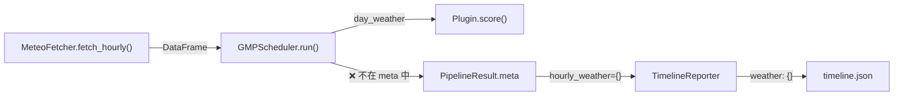

# MG3A: 后端 — timeline.json 逐时天气数据填充

> **For Claude:** REQUIRED SUB-SKILL: Use executing-plans to implement this plan task-by-task.

**Goal:** 将 Scheduler 已获取的逐时天气 DataFrame 注入 PipelineResult.meta，使 TimelineReporter 能够输出温度、云量、天气图标等逐时天气数据到 timeline.json。

**依赖模块:** M06 (MeteoFetcher), M12 (Scheduler), M11B (TimelineReporter)

---

## 背景

当前 `timeline.json` 的 weather 字段始终为空：



**根因**：[scheduler.py L170-174](file:///Users/mpb/WorkSpace/golden-moment-predictor/gmp/core/scheduler.py#L170-L174) 构建 meta 时未注入天气数据。DataFrame 中的温度、云量等列已获取但未传递。

**修复目标**：让 timeline.json 每个小时输出 `temperature`、`cloud_cover`、`weather_icon` 三个字段，为前端逐时天气表（MG5A）提供数据。

---

## Task 1: Scheduler 注入逐时天气数据到 meta

**Files:**
- Modify: [scheduler.py](file:///Users/mpb/WorkSpace/golden-moment-predictor/gmp/core/scheduler.py)
- Test: [test_scheduler.py](file:///Users/mpb/WorkSpace/golden-moment-predictor/tests/unit/test_scheduler.py)

### 要实现的方法

在 `GMPScheduler` 中新增私有方法：

```python
def _extract_hourly_weather(
    self, local_weather: pd.DataFrame
) -> dict[str, dict[int, dict]]:
    """从 DataFrame 提取逐时天气 → {date: {hour: {temperature, cloud_cover, weather_icon}}}

    weather_icon 映射规则:
    - cloud_cover < 20% → "clear"
    - cloud_cover < 50% → "partly_cloudy"
    - cloud_cover < 80% 且 precip_prob >= 50% 且 temp < 0 → "snow"
    - cloud_cover < 80% 且 precip_prob >= 50% → "rain"
    - 其他 → "cloudy"
    """
```

修改 `run()` 方法（[L170-174](file:///Users/mpb/WorkSpace/golden-moment-predictor/gmp/core/scheduler.py#L170-L174)），在 meta 构建处调用此方法：

```diff
 meta = {
     "generated_at": datetime.now(_CST).isoformat(),
     "data_freshness": data_freshness,
+    "hourly_weather": self._extract_hourly_weather(local_weather),
 }
```

### 应测试的内容

- `run()` 返回的 `meta` 包含 `hourly_weather` 字段
- `hourly_weather` 格式为 `{date_str: {hour_int: {temperature, cloud_cover, weather_icon}}}`
- weather_icon 映射：cloud_cover=10% → "clear"，cloud_cover=60% → "cloudy"
- 空 DataFrame → 返回空 dict

---

## Task 2: TimelineReporter 支持新数据格式

**Files:**
- Modify: [timeline_reporter.py](file:///Users/mpb/WorkSpace/golden-moment-predictor/gmp/output/timeline_reporter.py)
- Test: [test_timeline_reporter.py](file:///Users/mpb/WorkSpace/golden-moment-predictor/tests/unit/test_timeline_reporter.py)

### 修改内容

[timeline_reporter.py L27](file:///Users/mpb/WorkSpace/golden-moment-predictor/gmp/output/timeline_reporter.py#L27) 当前直接读取 `result.meta["hourly_weather"]` 为 `{hour: dict}` 格式。Task 1 改为 `{date: {hour: dict}}` 格式后，需要先按日期索引：

```python
raw_weather = result.meta.get("hourly_weather", {})
date_str = target_date.isoformat()
# 新格式: {date_str: {hour: dict}}
hourly_weather = raw_weather.get(date_str, {})
```

同时需要更新 `_make_hourly_weather()` 和 `_make_pipeline_result()` 测试 helper 以适配新格式。

### 应测试的内容

- 新增测试类 `TestTimelineReporterWeatherFields`：
  - weather 包含 `temperature` 字段
  - weather 包含 `cloud_cover` 字段
  - weather 包含 `weather_icon` 字段
  - 无天气数据时 weather 为空 dict
- 已有测试全部通过（无回归）

---

## 验证命令

```bash
source venv/bin/activate

# 单元测试
pytest tests/unit/test_scheduler.py -v -k "hourly_weather"
pytest tests/unit/test_timeline_reporter.py -v

# 集成验证 — 检查生成的 timeline JSON
python -m gmp.main generate-all --output public/data --no-archive
cat public/data/viewpoints/gongga_zimei_pass/timeline_*.json | python3 -m json.tool | head -30
```

Expected: timeline hourly 每条记录的 weather 包含 `temperature`、`cloud_cover`、`weather_icon` 三个字段。

---

*文档版本: v1.0 | 创建: 2026-02-19 | 关联: 设计文档 §11.6, M12, M11B*
