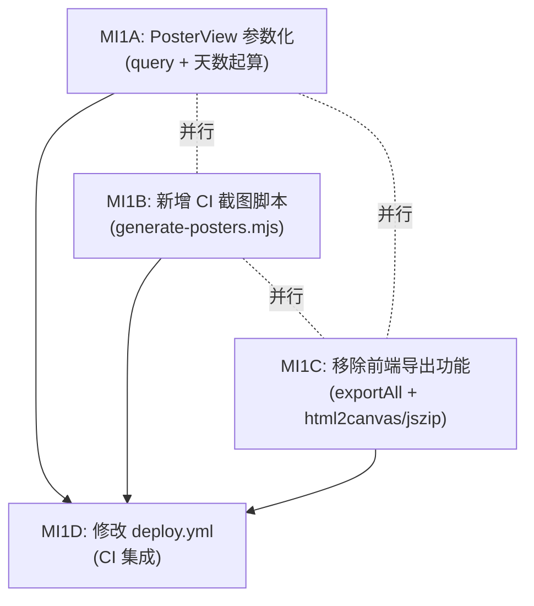

# CI 预生成海报 — 总览

> **For Claude:** REQUIRED SUB-SKILL: Use superpowers:executing-plans to implement this plan task-by-task.

**Goal:** 将海报图片截图和 JSON 摘要的生成从浏览器端移到 CI 端，作为静态资源部署。

**设计文档:** [`2026-02-28-ci-poster-generation-design.md`](file:///Users/mpb/WorkSpace/golden-moment-predictor/docs/plans/2026-02-28-ci-poster-generation-design.md)

---

## Task 拆分与依赖关系

| Task | 文件 | 可并行 | 描述 |
|------|------|--------|------|
| [MI1A](file:///Users/mpb/WorkSpace/golden-moment-predictor/implementation_plan/MI1A-poster-parameterize.md) | PosterView.vue | ✅ 与 B/C 并行 | URL query `?days=N` + 天数从明天开始 |
| [MI1B](file:///Users/mpb/WorkSpace/golden-moment-predictor/implementation_plan/MI1B-poster-ci-script.md) | scripts/generate-posters.mjs | ✅ 与 A/C 并行 | Playwright 截图 + buildSummary JSON 生成 |
| [MI1C](file:///Users/mpb/WorkSpace/golden-moment-predictor/implementation_plan/MI1C-poster-remove-export.md) | PosterView.vue, package.json | ✅ 与 A/B 并行 | 移除 exportAll、html2canvas、jszip |
| [MI1D](file:///Users/mpb/WorkSpace/golden-moment-predictor/implementation_plan/MI1D-poster-ci-deploy.md) | deploy.yml | ❌ 需 A+B+C 完成 | CI 流程集成 + 端到端验证 |

> [!IMPORTANT]
> **MI1A / MI1B / MI1C 三者完全独立，可并行开发。**
> MI1D 是最终集成，依赖前三者全部完成。
