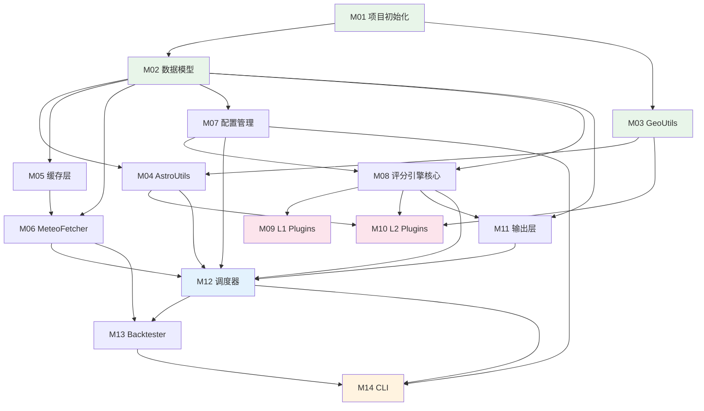

# 川西旅行景观预测引擎 — 实施计划总览

> **For Claude:** REQUIRED SUB-SKILL: Use executing-plans to implement this plan task-by-task.

**Goal:** 从零实现 GMP 引擎，涵盖天文/地理计算、气象数据获取与缓存、6 个评分 Plugin、CLI/JSON 输出、历史回测全链路。

**Architecture:** Plugin 驱动的预计算引擎，Scheduler 聚合 Plugin 数据需求后统一获取，通过 DataContext 共享给各 Plugin 独立评分，输出 JSON 文件供前端读取。

**Tech Stack:** Python 3.11+, click, structlog, pandas, ephem, httpx, pyyaml, SQLite

---

## 模块总览

| 编号 | 模块 | 文件 | 描述 | 依赖 |
|------|------|------|------|------|
| M01 | [项目初始化](./M01-project-init.md) | pyproject.toml, venv, 目录骨架 | 创建项目结构、安装依赖 | — |
| M02 | [数据模型与异常](./M02-data-models-exceptions.md) | `gmp/core/models.py`, `gmp/core/exceptions.py` | 所有 dataclass + 异常类 | M01 |
| M03 | [GeoUtils 地理计算](./M03-geo-utils.md) | `gmp/data/geo_utils.py` | 方位角、距离、光路点计算 | M01 |
| M04 | [AstroUtils 天文计算](./M04-astro-utils.md) | `gmp/data/astro_utils.py` | 日出日落、月相、观星窗口 | M02, M03 |
| M05 | [SQLite 缓存层](./M05-cache-layer.md) | `gmp/cache/repository.py`, `gmp/cache/weather_cache.py` | DB 操作 + 缓存管理 | M02 |
| M06 | [MeteoFetcher 数据获取](./M06-meteo-fetcher.md) | `gmp/data/meteo_fetcher.py` | Open-Meteo API 调用 + 解析 | M02, M05 |
| M07 | [配置管理](./M07-config-manager.md) | `gmp/core/config_loader.py` | ConfigManager + ViewpointConfig + RouteConfig | M02 |
| M08 | [评分引擎核心](./M08-scoring-engine.md) | `gmp/scoring/engine.py`, `gmp/scoring/models.py` | ScoreEngine + DataContext + Plugin 接口 | M02, M07 |
| M09 | [L1 评分 Plugins](./M09-l1-scoring-plugins.md) | `gmp/scoring/plugins/{cloud_sea,frost,snow_tree,ice_icicle}.py` | 仅需本地天气的 4 个 Plugin | M08 |
| M10 | [L2 评分 Plugins](./M10-l2-scoring-plugins.md) | `gmp/scoring/plugins/{golden_mountain,stargazing}.py` | 需远程数据/天文数据的 2 个 Plugin | M03, M04, M08 |
| M11 | [输出层](./M11-output-layer.md) | `gmp/output/*.py` | Reporter + SummaryGenerator + JSONFileWriter | M02, M08 |
| M12 | [调度器 GMPScheduler](./M12-scheduler.md) | `gmp/core/scheduler.py` | 主调度器：Plugin 收集→数据获取→评分→输出 | M04, M06, M07, M08, M11 |
| M13 | [Backtester 历史校准](./M13-backtester.md) | `gmp/backtest/backtester.py` | 使用历史数据验证评分模型 | M06, M12 |
| M14 | [CLI 入口](./M14-cli-entry.md) | `gmp/main.py` | click CLI: predict / generate-all / backtest / list-* | M07, M12, M13 |

## 模块依赖图



## 推荐执行顺序

> **并行友好**: M03 和 M05 可以并行开发；M09 和 M10 可以并行开发；M11 可以与 M09/M10 并行。

1. **基础层** (顺序): M01 → M02
2. **工具层** (可并行): M03 | M05 | M07
3. **数据层**: M04 → M06
4. **核心层**: M08
5. **插件层** (可并行): M09 | M10 | M11
6. **集成层** (顺序): M12 → M13 → M14

## 全局约定

### TDD 流程
每个模块遵循 Red-Green-Refactor:
1. 写失败测试
2. 运行确认失败
3. 写最小实现通过测试
4. 运行确认通过
5. 重构（保持绿色）
6. 提交

### 配置驱动
- **所有评分阈值/权重来自 `engine_config.yaml`**，代码中零魔法数字
- Plugin 构造函数接受配置 dict
- 测试中通过 fixture 提供测试配置

### 提交规范
```
feat(module): 简短描述
test(module): 添加测试
refactor(module): 重构改进
```

### 测试命令
```bash
# 单模块测试
python -m pytest tests/unit/test_geo_utils.py -v

# 全量测试
python -m pytest tests/ -v

# 带覆盖率
python -m pytest tests/ --cov=gmp --cov-report=term-missing
```

---

*文档版本: v1.0 | 创建: 2026-02-12 | 基于设计文档 v4.0*
